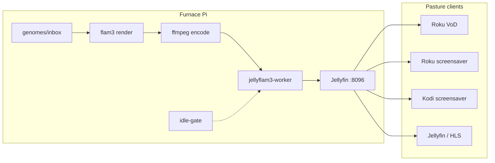

# JellyFlam3 Server [](https://deepwiki.com/awuehler/jellyflam3-server)

JellyFlam3 Server is a self-hosted generative media server that renders flam3-inspired visuals, processes them with ffmpeg, and serves continuous ambient streams to **Roku** and **Kodi** clients (and any Jellyfin/HLS-capable player on your LAN).

> **Short:** JellyFlam3 Server streams generative dreams, flame fractals, and social-screensaver visuals from a self-hosted media server to TVs and connected displays

> **Playful:** JellyFlam3 Server is a dream engine for your screens: part Jellyfin, part Electric Sheep, part flam3-powered visual furnace

## Who is this for?

Homelab operators and enthusiasts who already run (or will run) **Jellyfin on a Raspberry Pi 5**, accept **Roku developer sideloading** (no Channel Store package in v0.3.0), and want a slow, quality-first generative flock — not a plug-and-play smart-TV app. First sheep can take **hours**; a sizeable herd takes **months**. See [User guide & runbook](docs/USER_GUIDE_AND_RUNBOOK.md) (Layer 1) for viewers; [Pi from scratch](docs/phase2/09_PI_FROM_SCRATCH.md) for install.

**Requires:** Pi 5 + NVMe + sheep disk, Jellyfin, flam3/ffmpeg toolchain, optional Kodi pasture box. **Windows packaging** (`*.ps1`) builds client zips but does **not** embed furnace Jellyfin presets — paste IDs manually or build on the Pi.

## Architecture

**Furnace** (Raspberry Pi) renders `.flam3` genomes → ffmpeg encodes H.264 loops → **Jellyfin** catalogs the flock → **pasture** clients play on your LAN.



Full design: [docs/Pi5_Flam3_VoD_Pipeline.md](docs/Pi5_Flam3_VoD_Pipeline.md).

### Demo — `electricsheep.242.03322` (CC BY)

Sample flock still (~20 s loop when played on a client; complementary palette). [License notes](docs/phase1/07_LICENSE_AND_METADATA.md).


## Documentation

Phases 1–3 are **complete** (Owner OK 2026-08-23). Post-launch roadmap items live under `docs/phase4/` (not part of v0.3.0).

- **Phase 1** — [docs/phase1/](docs/phase1/) · [00_OVERVIEW.md](docs/phase1/00_OVERVIEW.md)
- **Phase 2** — [docs/phase2/](docs/phase2/) · [00_OVERVIEW.md](docs/phase2/00_OVERVIEW.md)
- **Phase 3** — [docs/phase3/](docs/phase3/) · [00_OVERVIEW.md](docs/phase3/00_OVERVIEW.md)
- **Guides index** — [docs/README.md](docs/README.md) · **Users** — [User guide & runbook](docs/USER_GUIDE_AND_RUNBOOK.md)

## Quick start (Raspberry Pi 5)

End-to-end bring-up is documented in **[docs/phase2/09_PI_FROM_SCRATCH.md](docs/phase2/09_PI_FROM_SCRATCH.md)** (RPi hardware profiles `-16` / `-08` / `-04`, mounts, Jellyfin paths/perms, systemd). Use `./scripts/bringup_check.sh` after each major stage.

1. **Flash OS** — Raspberry Pi OS 64-bit; user `jellyflam3`; hostname `rpi-jellyflam3-{16,08,04}a` (letter suffix); Active Cooler + NVMe + USB SSD; **SSH key** (`ssh-copy-id`).
2. **Disks** — NVMe → `/var/cache/jellyflam3` (Jellyfin CachePath + frames); bind `…/lib` → `/var/lib/jellyflam3` (MetadataPath); USB SSD → `/media/sheep`. Then `./scripts/bootstrap_pi.sh`.
3. **Clone + config** — prefer SSH remote; symlink `/opt/jellyflam3-server`; append JellyFlam3 `PATH` / `PYTHONPATH` to `~/.bashrc`; copy example yaml/secrets; **never commit** `secrets.env` or a filled `jellyflam3.yaml`.
4. **Toolchain** — `./scripts/install_flam3.sh` then smoke (`JELLYFLAM3_SMOKE=1 ./scripts/smoke_render.sh`).
5. **Jellyfin** — `./scripts/install_jellyfin.sh` (perms **before** Cache/Metadata paths; wizard; Sheep → `/media/sheep/by-generation`; Rework Poster → `/media/sheep/_refactor-preview`; API key; V4L2). Fill `secrets.env`; `python3 scripts/jellyfin_id_dump.py`; `python3 -m pipeline.media_layout`.
6. **Units + first sheep** — enable worker / idle-gate / display-sink; seed inbox; validate with healthcheck / `bringup_check`.

```bash
# On the RPi (after mounts exist):
cd /home/jellyflam3/GitHub

git clone git@github.com:awuehler/jellyflam3-server.git   # or your fork

cd jellyflam3-server

sudo ln -sfn "$(pwd)" /opt/jellyflam3-server

# Update the local shell environment:
# ~/.bashrc (jellyflam3) — flam3 + scripts + python -m pipeline.*
grep -q 'JellyFlam3: Development' ~/.bashrc 2>/dev/null || cat >> ~/.bashrc <<'EOF'
# JellyFlam3: Development
#export PATH="$PATH:/usr/local/bin:/home/jellyflam3/GitHub/jellyflam3-server/scripts:."
#export PYTHONPATH="/home/jellyflam3/GitHub/jellyflam3-server"

# JellyFlam3: Deployment
export PATH="$PATH:/usr/local/bin:/opt/jellyflam3-server/scripts:."
export PYTHONPATH="/opt/jellyflam3-server"

EOF

pip3 install -r requirements.txt --user   # or a venv

cp configs/jellyflam3.yaml.example configs/jellyflam3.yaml

cp secrets.env.example secrets.env        # fill after Jellyfin wizard; do not commit

python3 -m pipeline.hw_profile apply 04a  # or 08a / 16a — must match hostname class

./scripts/bootstrap_pi.sh

./scripts/install_flam3.sh

export JELLYFLAM3_SMOKE=1 && ./scripts/smoke_render.sh

./scripts/install_jellyfin.sh             # follow printed perms / paths / ParentId / V4L2 notes

# After wizard + secrets.env:
python3 scripts/jellyfin_id_dump.py

python3 -m pipeline.media_layout --config configs/jellyflam3.yaml

sudo cp deploy/systemd/jellyflam3-*.service /etc/systemd/system/

sudo systemctl daemon-reload

sudo systemctl enable --now jellyflam3-idlegate jellyflam3-worker jellyflam3-display-sink

python3 -m pipeline.seed_inbox --config configs/jellyflam3.yaml --archive --fetch-count 1

./scripts/bringup_check.sh --strict

./scripts/healthcheck.sh
```

Deep dives (same path, split by topic): [hardware](docs/phase1/01_HARDWARE_AND_OS.md) · [repo/config](docs/phase1/02_REPO_AND_CONFIG.md) · [flam3](docs/phase1/03_FLAM3_AND_FFMPEG.md) · [Jellyfin](docs/phase1/04_JELLYFIN_LIBRARY.md) · [worker](docs/phase1/05_RENDER_PIPELINE.md) · [ops](docs/phase1/09_RUNTIME_AND_OPS.md).

## Components

| Piece | Links |
|---|---|
| flam3 | [scottdraves/flam3](https://github.com/scottdraves/flam3) · [flam3.com](https://flam3.com/) |
| Electric Sheep | [scottdraves/electricsheep](https://github.com/scottdraves/electricsheep) · [electricsheep.org](https://electricsheep.org/) |
| ffmpeg | [FFmpeg/FFmpeg](https://github.com/FFmpeg/FFmpeg) · [ffmpeg.org](https://ffmpeg.org/) |
| Jellyfin | [jellyfin/jellyfin](https://github.com/jellyfin/jellyfin) · [docs](https://jellyfin.org/docs/) |
| BrightScript / Roku | [developer.roku.com](https://developer.roku.com/) · [jellyfin-roku](https://github.com/jellyfin/jellyfin-roku) |

## License

JellyFlam3 Server code is licensed under the MIT License (see [LICENSE](LICENSE)). Third-party components retain their own licenses; see [NOTICE](NOTICE). Electric Sheep **Free** genomes may be CC BY (human) or CC BY-NC (brood/algorithm); robot remixes of human parents stay NC under ES rules — see [docs/phase1/07_LICENSE_AND_METADATA.md](docs/phase1/07_LICENSE_AND_METADATA.md).

**Contributing:** [CONTRIBUTING.md](CONTRIBUTING.md) · **Security:** [SECURITY.md](SECURITY.md) · **Releases:** [CHANGELOG.md](CHANGELOG.md)

> [!WARNING]
> Do not ingest Gold Sheep or Infinidream masters !

## Addendum

This is a "go slow" approach to (re)create fractal flames using one ARM64 single-board computer to (re)render flam3 scene/configuration files.

Furthermore, this effort is biased towards "quality over quantity" with each successful video scaled and optimized for large format TV displays which need additional hours (occasionally days) of CPU for each mp4 output file.

Your local flock of sheep will require months of continuous rendering to build a sizeable herd for sharing, for pedigree breeding, or for other end-points.

_Tokenomics (Token Economics): approximately $20 within each phase listed above_
