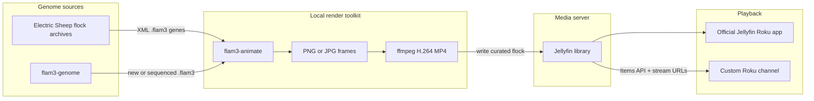
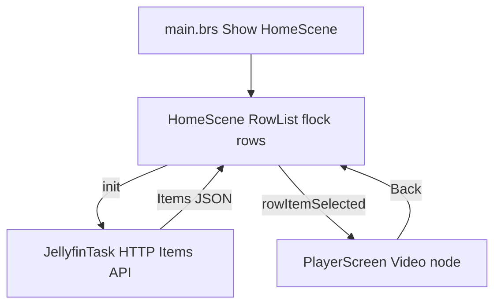
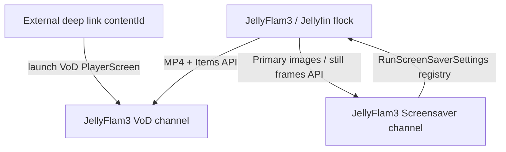
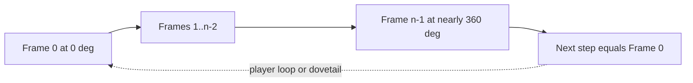
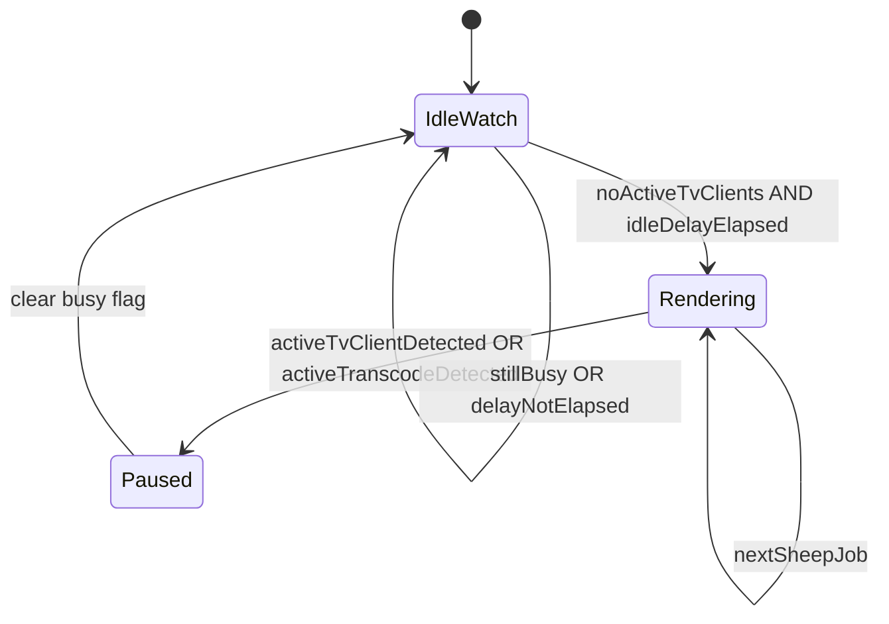
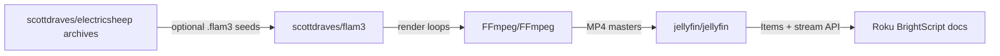
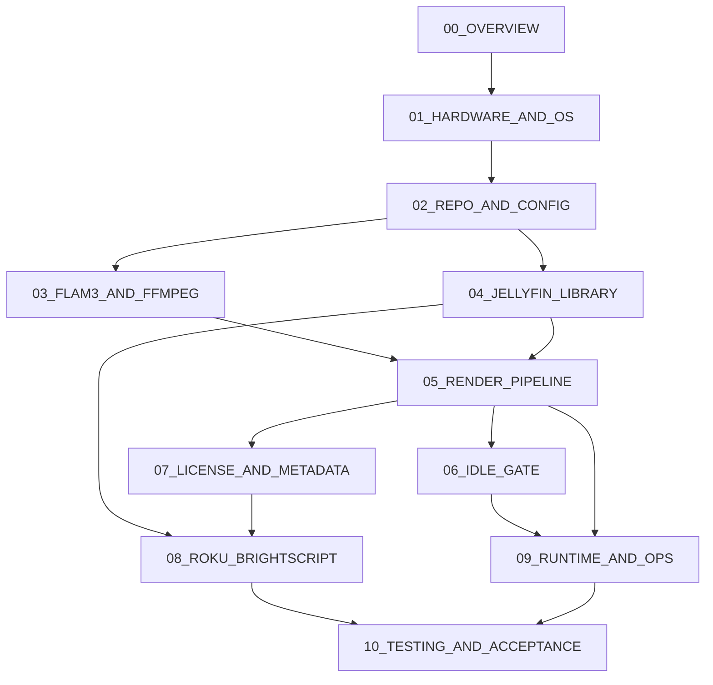
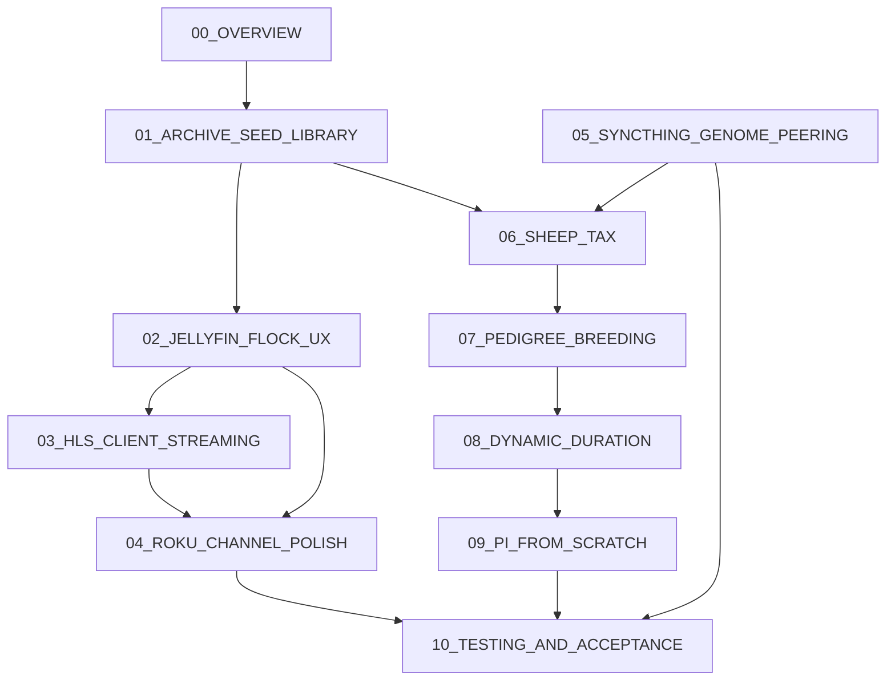
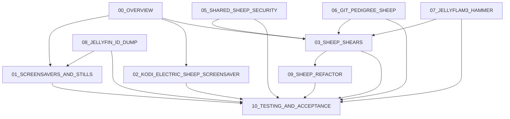

# JellyFlam3 Server

## Project Horizon

**Name:** JellyFlam3 Server

**One-line (short):** JellyFlam3 Server streams generative dreams, flame fractals, and social-screensaver visuals from a self-hosted media server to TVs and connected displays.

**Playful:** JellyFlam3 Server is a dream engine for your screens: part Jellyfin, part Electric Sheep, part flam3-powered visual furnace.

**Technical (canonical for README / architecture):** JellyFlam3 Server is a self-hosted generative media server that renders flam3-inspired visuals, processes them with ffmpeg, and serves continuous ambient streams to **Roku** and **Kodi** clients (and any Jellyfin/HLS-capable player on your LAN).

**Longer product blurb:** JellyFlam3 Server is a self-hosted media-art server for generating, encoding, and streaming ambient dream visuals to Roku devices and TVs. Inspired by Electric Sheep, flam3, and Scott Draves’ generative screensaver work, it turns idle screens into living canvases—organizing and serving evolving ambient artwork rather than movies or shows.

### Core ideas locked into this plan

| Idea | How it shows up in the architecture |
|---|---|
| **Self-hosted dream media server** | Pi/NAS runs render + library + stream origin; no dependence on live Electric Sheep servers |
| **Generative ambient art, not VoD cinema** | Catalog is a curated flock of seamless looping “dreams,” designed for background / always-on displays |
| **Electric Sheep + flam3 heritage** | `.flam3` genomes, `flam3-genome` / `flam3-animate`, 360° closed sheep loops |
| **ffmpeg as the packaging furnace** | Frame sequences → H.264 (and related) streamable masters for devices |
| **Jellyfin-like library model** | Organize, tag, auth, and serve media (initially via Jellyfin; JellyFlam3 is the product layer around generate → encode → flock → stream) |
| **Idle TVs as canvases** | Roku BrightScript client with looping playback for ambient dreamscapes |
| **Between media server, screensaver network, and art engine** | Phase 1 = generate + curate + stream; later phases can add social curation and more render backends |

### Scope phasing (so vision stays honest)

- **Phase 1 (complete):** flam3-style flame fractals → seamless loop MP4s → Jellyfin-backed flock → Roku BrightScript (+ jellyfin-roku for ops). Owner signed 2026-07-28. Guides: [`docs/phase1/`](phase1/00_OVERVIEW.md).
- **Phase 2 (complete — Owner OK 2026-08-08):** Jellyfin flock UX + **HLS** client streaming + Roku polish/display probe; Syncthing/`*.flam3` peering over Tailscale; sheep tax; pedigree breed; dynamic duration (period-aware, hard max **120 s**); Pi-from-scratch profiles **16 / 08 / 04**. Baseline: archive seeder, TV-port, Gold Sheep Lite, OkLCh. Guides: [`docs/phase2/`](phase2/00_OVERVIEW.md) · acceptance [10](phase2/10_TESTING_AND_ACCEPTANCE.md).
- **Phase 3 (guides 01–10 complete — Owner OK 2026-08-23):** Roku stills screensaver (**01**); Kodi ES-dogma screensaver (**02** loops-only; loop→edge→loop post-launch); Sheep Shears (**03**); shared sheep security (**05**); git pedigree sheep (**06**); Hammer (**07**); Jellyfin ID dump + furnace client zip presets (**08**); **sheep refactor** (**09** — pathways A/P/B/C/D); acceptance (**10**). Git tag **`v0.3.0` at public launch**. LLM pedigree / DeepDream/social aspirational. Guides: [`docs/phase3/`](phase3/00_OVERVIEW.md). Post-launch roadmap (edges + watermark, peer share-path, mesh scripting, **Roku VoD + screensaver publish**, **viewer feedback loop**, **sheep naming**): [`docs/phase4/`](phase4/00_OVERVIEW.md) (synopsis).

DeepDream and multi-backend “visual furnace” language stays in the **product story**. Complementary ambient-TV palettes and archive seeding are **baseline shipped**. Phase boundary detail and per-guide tables: [Phase 1](#phase-1-guideline-documents-discrete-task-boundaries) · [Phase 2](#phase-2-guideline-documents-discrete-task-boundaries) · [Phase 3](#phase-3-guideline-documents-synopsis-boundaries) below.

---

## The separation (flam3 toolkit vs Electric Sheep archives)



| Piece | What it is | Needs ES servers? |
|---|---|---|
| **flam3** (`flam3-render`, `flam3-animate`) | Open-source renderer: genome XML → frames | No |
| **flam3-genome** | Genome factory: random, mutate, cross, rotate, `sequence` | No |
| **Electric Sheep flock archives** | Public library of evolved `.flam3` XML | Download once only |
| **Jellyfin** | Open-source media server: store curated flock, metadata, auth, stream/transcode for clients | No |

Electric Sheep the screensaver is a distributed social system. This plan does **not** run that stack. Locally you: get/create `.flam3` → expand to animation → render → encode → **ingest into Jellyfin** → Roku plays from Jellyfin.

`flam3-genome` is separate from the archives because archives are **content**; `flam3-genome` is a **tool** that invents new content or turns a still genome into an ES-style loop/transition.

---

## Two ways to feed the pipeline

**A. Archived sheep** — download `.flam3`, expand with `flam3-genome sequence=…`, render. Watch CC BY vs BY-NC for commercial channels.

**B. Generated genomes** — `flam3-genome` random/mutate/cross with a TV template; fully offline after install.

**Default:** curated seed library + `flam3-genome` to expand each seed into a renderable clip; overnight generative queue optional.

---

## Jellyfin’s role (curated flock + VoD origin)

Jellyfin sits between the render factory and Roku:

1. **Storage** — filesystem library of finished H.264 MP4 sheep (and posters).
2. **Curation** — collections, genres/tags (generation, designer, license), favorites, playlists (“Flock 247”, “Human-designed”, “Safe for commercial”).
3. **Catalog API** — `/Items`, `/Users/{id}/Items` for a custom Roku channel to build grids without hand-maintained JSON.
4. **Playback** — **Phase 2 first-class HLS** to Roku, VLC, and similar clients via Jellyfin (`master.m3u8` / PlaybackInfo), preferring Direct Stream/remux of Gold Sheep Lite H.264+AAC masters; static MP4 Direct Play (`/Videos/{itemId}/stream.mp4?Static=true`) remains for ambient loop when HLS loop is weak; full HLS **transcode** is fallback under the idle-gate.
5. **Auth** — API keys / user sessions so the channel is not an open directory listing.

### Library layout (on disk)

Organize for Jellyfin movie/home-video scanning and easy curation:

```text
/media/sheep/
  by-generation/
    247/
      electricsheep.247.16021.mp4
      electricsheep.247.16021-poster.jpg   # optional, from flam3-render
    244/
      ...
  playlists/          # optional symlink sets or Jellyfin collections only
```

- Live **Sheep** Jellyfin library pointed at `/media/sheep/by-generation` (not the mount root). Optional second library for refactor previews → `/media/sheep/_refactor-preview`.
- Filename = stable ID (`electricsheep.{gen}.{id}`) so re-renders replace cleanly and match genome archives.
- Sidecar NFO or Jellyfin API metadata: title, overview (lineage), tags `cc-by` / `cc-by-nc`, `generation-247`, `human` / `brood`.

### Encode so Jellyfin can Direct Stream (HLS) and Direct Play

Prefer remux-friendly masters so Pi CPU is not spent re-encoding on every view:

- Container: **MP4**
- Video: H.264 High, level ≤ 4.2, yuv420p, progressive 1080p
- Audio: AAC stereo **or** silent (Jellyfin/Roku tolerate no-audio; a short silent AAC track is safer for some clients)
- `+faststart` (moov at front) for progressive HTTP

**Phase 2 delivery:** Jellyfin serves these masters as **HLS** (Direct Stream / remux into fMP4 or TS segments) to Roku, VLC, jellyfin-roku, and similar endpoints. **Direct Play** of the static MP4 remains supported—especially for ambient loop on Roku when HLS re-loop gaps, and to avoid long-session remux `.ts` lifecycle WRNs (Jellyfin may stop the remux job after many minutes while the client still requests segments). Full HLS **transcode** stays available for odd devices but must not defeat the idle-gate while `flam3-animate` runs. See Phase 2 guide [03_HLS_CLIENT_STREAMING.md](phase2/03_HLS_CLIENT_STREAMING.md#known-limitation-long-running-hls-vod-sessions).

### Two Roku integration paths (both supported)

**Path 1 — Official [jellyfin-roku](https://github.com/jellyfin/jellyfin-roku) channel (fastest)**  
- Install Jellyfin Roku channel, point at the Pi’s Jellyfin URL.  
- Users browse the Sheep library in the standard Jellyfin UI.  
- Best when “a Roku channel” can mean the Jellyfin client, not a branded custom store channel.

**Path 2 — Custom branded Roku channel (VoD app)**  
- Channel uses Jellyfin REST API (API key or user token):
  - List flock: `GET /Users/{userId}/Items?ParentId={sheepLibraryId}&IncludeItemTypes=Movie`
  - Artwork: Jellyfin image endpoints for Primary/Backdrop
  - Play: set Video node `url` to authenticated HLS remux  
    `https://jellyfin.example/Videos/{itemId}/main.m3u8?MediaSourceId={itemId}&api_key=…&AudioCodec=aac`  
    with MP4 fallback `…/stream.mp4?Static=true&api_key=…` on error or when ambient loop needs it  
    (avoid `master.m3u8` on Jellyfin 10.11 — may inject broken `AudioCodec=m3u8`)
- `streamformat`: `"hls"` for Jellyfin HLS (Phase 2 default path); `"mp4"` for static Direct Play fallback.
- Catalog, posters, and duration come from Jellyfin item fields — no separate sidecar feed required.

**Locked default:** run Jellyfin as the single source of truth; support Path 1 immediately; build Path 2 as a branded BrightScript/SceneGraph channel against the same Items + stream APIs (see next section).

---

## BrightScript Roku app for VoD sheep playback

Custom channel = **SceneGraph UI (XML) + BrightScript (`.brs`) logic**. BrightScript fetches the flock from Jellyfin, maps items to `ContentNode`s, and plays them with the `Video` node. Official docs: [Playing videos](https://developer.roku.com/docs/developer-program/media-playback/playing-videos.md), [Content meta-data](https://developer.roku.com/docs/developer-program/getting-started/architecture/content-meta-data.md).

### Channel package layout

```text
sheep-channel/
  manifest                 # title, major_version, mm_icon_focus_hd, sg_version_number, etc.
  source/
    main.brs               # Show(screen) entry → HomeScene
  components/
    HomeScene.xml          # RowList / MarkupGrid + overlays
    HomeScene.brs
    PlayerScreen.xml       # full-screen Video node
    PlayerScreen.brs
    tasks/
      JellyfinTask.xml     # roUrlTransfer in a Task node (network off UI thread)
      JellyfinTask.brs
  images/
    mm_icon_focus_hd.png
    splash-screen.png
```

Sideload via Roku Developer Settings / `rokudev` package upload while iterating; later submit to the Channel Store if public distribution is required.

### Screen flow



1. **Home** — rows such as “Generation 247”, “Human-designed”, “Recently added” (Jellyfin collections or filtered queries).
2. **Detail (optional)** — title, overview, license tag, poster; Play / Back.
3. **Player** — full-screen `Video`; Back stops and returns home. Sheep masters are **closed loops**; set `loop = true` so playback repeats without a cut (see Seamless video loops).

### Jellyfin access from BrightScript

Do **not** call `roUrlTransfer` on the render thread. Use a **Task** component:

- Inputs (fields): `baseUrl`, `apiKey` (or user token), `userId`, `libraryId`, `command` (`list` | `streamUrl`).
- Task runs `roUrlTransfer` with Jellyfin headers, e.g. `Authorization: MediaBrowser Token=…` (and device/client identity as Jellyfin expects).
- Parse JSON with `ParseJson()`; set an output field `items` / `error` that HomeScene observes.

Typical list call:

`GET {baseUrl}/Users/{userId}/Items?ParentId={libraryId}&IncludeItemTypes=Movie&Recursive=true&Fields=Overview,Path,PrimaryImageAspectRatio,RunTimeTicks,Tags`

Map each Jellyfin item → child `ContentNode`:

| Jellyfin field | ContentNode field |
|---|---|
| `Name` | `title` |
| `Overview` | `description` |
| `Id` | `id` / custom `jellyfinId` |
| Primary image URL | `hdPosterUrl` / `sdPosterUrl` |
| `RunTimeTicks` / 10_000_000 | `length` (seconds) |
| Built stream URL | `url` |
| `"mp4"` or `"hls"` | `streamFormat` |

Stream URL pattern for direct play:

`{baseUrl}/Videos/{itemId}/stream.mp4?Static=true&api_key={key}`

Prefer storing `jellyfinId` on the node and building the stream URL at play time so tokens stay fresh. Filter out items tagged `cc-by-nc` in BrightScript when the channel is commercial.

Config: Jellyfin base URL + credentials via channel registry (`roRegistrySection`) or a first-run settings screen (LAN IP may change).

### Playback with the Video node

In `PlayerScreen.brs` (pattern from Roku’s SceneGraph guides):

```brightscript
sub playSheep(item as object)
  content = createObject("roSGNode", "ContentNode")
  content.url = item.url
  content.streamFormat = "hls"   ' Phase 2 default; "mp4" for Static Direct Play fallback
  content.title = item.title
  content.length = item.length

  m.video = m.top.findNode("Video")
  m.video.content = content
  m.video.visible = true
  m.video.control = "play"
end sub
```

XML sketch:

```xml
<Video id="Video" width="1920" height="1080" />
```

- Observe `state` for `finished` / `error`. Prefer `m.video.loop = true` so a finished sheep restarts at frame 0 with no playlist gap (matches the closed 360° render). Optionally on `finished`, advance to the next sheep in the row for a flock “radio” mode.
- Buffering UI is built into `Video`; keep sheep masters direct-playable so startup stays short.

### UI components to use

- **`RowList`** — horizontal rows of sheep posters (primary flock browser).
- **`MarkupGrid`** — alternate dense grid for a single generation.
- **`Poster`** — art from Jellyfin `/Items/{id}/Images/Primary?maxHeight=360`.
- **`Label` / `BusySpinner`** — loading and empty states when Jellyfin is unreachable.

Keep branding simple: flock name as hero-level title on home; avoid dashboard clutter.

### Deep linking + future Roku TV screensaver integration

Two related but **separate** Roku surfaces share the JellyFlam3 flock. Do not conflate them: deep linking belongs to the **VoD channel**; the **screensaver** is a later standalone package with stricter platform rules.

#### A. Deep linking (Phase 1 channel — recommended)

Support Roku launch / input params so external prompts can open a dream directly:

- Read `contentId` (and optional `mediaType`) from launch args / `roInputEvent`.
- Resolve `contentId` → Jellyfin item id (stable sheep id or Jellyfin GUID).
- Jump straight to `PlayerScreen` with looping playback (**Direct Publisher / certification** often expects deep link + direct-to-play for media apps).
- Mirror patterns in [jellyfin-roku Deep Linking](https://github.com/jellyfin/jellyfin-roku/wiki/Deep-Linking) and Roku’s [deep linking policy](https://developer.roku.com/docs/developer-program/discovery/implementing-deep-linking.md).

Example device ECP-style launch (dev testing):

`http://<roku-ip>:8060/launch/<channelId>?contentId=<jellyfinItemId>&mediaType=movie`

BrightScript sketch:

```brightscript
sub handleDeepLink(args as object)
  if args = invalid or args.contentId = invalid or args.contentId = "" then return
  item = m.jellyfin.resolveItem(args.contentId)
  if item <> invalid then showPlayer(item)  ' Video.loop = true
end sub
```

Also handle **re-deep-link while running** (`roInputEvent`) so a new `contentId` swaps the playing dream without relaunching the whole channel.

#### B. Shipped: standalone JellyFlam3 Screensaver (Phase 3 guide 01)

Goal: when the Roku TV is idle, show ambient JellyFlam3 dreams—the Electric Sheep “living canvas” moment—without requiring the user to open the VoD channel.

**Platform constraints** ([Roku Screensavers](https://developer.roku.com/docs/developer-program/media-playback/screensavers.md)) — plan around these explicitly:

| Rule | Implication for JellyFlam3 |
|---|---|
| Screensaver must be a **standalone** app | Separate package from the VoD channel (streaming apps must **not** embed screensavers) |
| Entry point is `RunScreenSaver()` only | No `Main()` / `RunUserInterface()` in the screensaver package |
| **No deep links** inside screensavers | Deep link targets the VoD channel, not the screensaver |
| **No user input** / interactive UI while saving | Any remote key exits screensaver back to prior app |
| **No video playback** in SceneGraph screensavers; avoid `roVideoPlayer` | Screensaver shows **images / canvas animation**, not H.264 `Video` node streams |
| Optional `RunScreenSaverSettings()` | First-run / settings UI for Jellyfin URL, API token, flock filters |
| Manifest requires `screensaver_title` | Distinct from VoD channel manifest |

**Architecture (shared dream backend, two clients):**



1. **VoD channel** — full BrightScript SceneGraph app; Video loops; deep links; catalog.
2. **Screensaver channel** — `RunScreenSaver()` draws a non-interactive ambient scene:
   - Fetch flock metadata from the same Jellyfin base URL stored in `roRegistrySection` (“JellyFlam3”).
   - Cycle **Primary** posters and/or dedicated **screensaver stills** (extra pipeline artifact: e.g. `flam3-render` frames or sampled PNG strips uploaded beside each MP4).
   - Crossfade / Ken-Burns on `roScreen` / `roImageCanvas` or a non-interactive SceneGraph scene (**no** `Video` node).
   - Advance on a timer (e.g. every 30–60s) through curated “ambient” collection / tags.
3. **Shared settings** — screensaver settings write `baseUrl`, `apiKey`, `libraryId`, `licenseFilter` to registry; VoD channel can read the same section so users configure once.
4. **Optional bridge the other way** — VoD channel settings screen offers “Install / open screensaver instructions” (cannot deep-link *into* the screensaver; point users to Settings → Theme → Screensavers).

**Screensaver package layout (shipped — `roku-screensaver/`):**

```text
roku-screensaver/
  manifest                 # screensaver_title=JellyFlam3 Dreams
  source/
    main.brs               # RunScreenSaver() + optional RunScreenSaverSettings()
  components/              # ScreenSaverScene; RegistryPresets.brs
  registry/                # jellyflam3-presets.json when built on furnace Pi
  images/
```

**Server-side support (shipped):**

- `pipeline.stills` — frame extract beside catalog MP4s; Primaries feed MVP screensaver.
- Sidecar tag `screensaver-safe`; idle-gate ignores `JellyFlam3-Screensaver` client pattern.
- Furnace `package_roku_*` + `client_pack_presets.py` bake Jellyfin IDs into sideload zips.

**Dev / cert notes:**

- Sideload screensaver separately; debug console on **port 8087** (screensaver context), not 8085.
- Samples: Roku [screensaver sample channels](https://developer.roku.com/docs/developer-program/media-playback/screensavers.md) under developer docs / rokudev samples.
- Store listing: screensaver appears under **Settings → Theme → Screensavers**, not as a Home-row streaming tile.

**Phase mapping:** Phase 1 ships VoD + deep linking hooks. Phase 2 adds **HLS** as first-class Jellyfin→client delivery (Roku / VLC / etc.), polishes flock posters/metadata and the VoD channel (including a TV display-settings probe → per-screen Pi `display_profiles/` sink — **guide 04 complete**). **Phase 3** adds stills + standalone **Roku** screensaver/Backdrop ([phase3/01](phase3/01_SCREENSAVERS_AND_STILLS.md)), and a **fully separate Kodi** Electric Sheep–dogma screensaver extension ([phase3/02](phase3/02_KODI_ELECTRIC_SHEEP_SCREENSAVER.md)) that can play video loops (and edges when Phase 4 edges exist).

### Dev / test loop

1. Enable Developer Mode on a Roku device on the same LAN as Jellyfin.
2. `curl`/package the channel zip; upload to the device.
3. Point the channel at the Pi Jellyfin URL; confirm RowList populates and MP4 direct play works before adding polish.
4. Test Back stack, error states (Jellyfin down), and license-filtered lists.

### Relationship to Path 1

BrightScript Path 2 does **not** replace Jellyfin — it is a branded client of the same server. Keep jellyfin-roku for admin/debug browsing; ship the BrightScript app as the public Sheep VoD experience.

---

## Hardware: Raspberry Pi 5 storage (microSD, PCIe, USB)

JellyFlam3 on a Pi 5 is **CPU-heavy** (flam3 + occasional Jellyfin transcode) and **IO-bursty** (thousands of PNG frame writes, then ffmpeg readback, then MP4 library reads for Roku). Storage choice affects render wall-clock, Jellyfin scrubbing, and card/drive lifespan more than raw “can it boot.”

### Workload → IO profile

| Stage | Dominant resource | Storage stress |
|---|---|---|
| `flam3-animate` | CPU (all cores) | Sustained **sequential writes** of frame PNGs/JPGs to scratch |
| `ffmpeg` encode | CPU (and optional HW encode) | **Sequential reads** of frames + **write** of H.264 MP4 |
| Jellyfin direct play | Network + light CPU | **Sequential reads** of MP4 masters |
| Jellyfin transcode | CPU + `jellyfin-ffmpeg` | Read master + **write** segment/temp cache |
| Idle-gate | — | Does not reduce IO need; only serializes CPU hogs |

**Rule of thumb:** put **OS + scratch + media library** on the fastest durable medium you can; treat microSD and USB flash sticks as bootstrap or cold backup only.

### Option comparison

| Medium | Interface | Typical sustained IO on Pi 5 | Capacity sweet spot | Good for | Limitations |
|---|---|---|---|---|---|
| **microSD** | SD slot (UHS-I class on Pi 5) | ~40–90 MB/s read, often **~15–40 MB/s write** (card-dependent) | 64–256 GB OS-only; up to ~1 TB exist but not ideal as sole disk | Boot/OS if nothing else; tiny test flocks | Random write & endurance weak; frame dumps wear cards; library + scratch on SD → slow encodes and early failure |
| **USB flash drive** (“thumb drive”) | USB 3.0 | Highly variable; many sticks **far below** USB SSD; poor random write | 64–256 GB casual | Moving `.flam3` seeds; offline backup of a few MP4s | **Not recommended** for `/media/sheep` or render scratch; TLC/QLC sticks die under continuous frame writes |
| **USB 3 SSD** (SATA SSD in enclosure) | USB 3.0 (5 Gbps) | Often **~300–400+ MB/s** seq. (enclosure/UASP matter) | **512 GB–2 TB** library+scratch | Strong value: media library + temp frames without a HAT | Extra cable/power; bus shared with other USB devices; slightly higher latency than NVMe |
| **NVMe via PCIe** (M.2 HAT+) | Pi 5 **PCIe x1** | Official **PCIe 2.0**: ~**500 MB/s** peak; unofficial Gen3 tweak can approach ~800–900 MB/s (stability varies) | **512 GB–2 TB** (2230/2242 on official HAT+) | **Optimal** OS boot + scratch + flock on one drive | Needs M.2 HAT+ / NVMe Base; form-factor limits (official HAT+: **2230/2242**, not always 2280); power/thermals; Gen3 not certified |

Official PCIe accessory overview: [Using the M.2 HAT+ with Raspberry Pi 5](https://www.raspberrypi.com/news/using-m-2-hat-with-raspberry-pi-5/) · product expectations: single-lane PCIe 2.0, up to **3 A** to the M.2 device, Active Cooler compatible.

### microSD Card (built-in)

- **Use when:** first bring-up, recovery, or OS-only with media on NVMe/USB SSD.
- **Prefer:** high-endurance or **A2 / V30 / U3** application-class cards if the OS must live on SD; avoid no-name bulk cards.
- **Limitations:** Pi 5 SD is effectively **UHS-I**-class throughput; writes bottleneck PNG dumps and Docker/Jellyfin metadata. Concurrent render scratch + library on one SD will stutter and shorten card life.
- **Capacity:** 32 GB minimum for OS experiments; **64–128 GB** if OS+logs only; do **not** size the flock onto SD.

### PCIe connector → M.2 NVMe (recommended primary path)

- Pi 5 exposes a **PCIe FPC** connector; add an **M.2 HAT+** (or under-board NVMe Base) for an M-key NVMe SSD.
- **Optimal JellyFlam3 layout (single NVMe):**
  - Partition or directories: `/` (OS), `/var/cache/jellyflam3/frames` (scratch), `/media/sheep` (MP4 flock + posters).
  - Boot from NVMe (`raspi-config` → Boot Order → NVMe/USB) so SD can be removed or kept as rescue only.
- **Capacity planning (order-of-magnitude):**
  - One 1080p seamless loop MP4 (**7–37 s**, ~4 Mbps) ≈ **~4–19 MB** per dream (order-of-magnitude).
  - **Working set:** one ~552-frame render can need **several GB** of temporary PNGs before encode deletes them.
  - Curated flock of hundreds–thousands of dreams + stills + Jellyfin DB → plan **≥512 GB**; **1–2 TB** if you keep multi-generation archives and high-quality masters.
- **Limitations:** HAT blocks some HATs/GPIO stacks; choose 2230/2242 drives for official HAT+; ensure cooling (Active Cooler + airflow) because NVMe + Pi 5 CPU under flam3 both heat the board; verify `nvme0n1` health (`smartctl`) periodically.
- **PCIe Gen3:** `dtparam=pciex1_gen=3` can raise bandwidth but is **unsupported**; only enable after burn-in if stable.

### USB Flash Drive vs USB SSD

| | USB flash (stick) | USB SSD enclosure |
|---|---|---|
| Endurance | Poor for 24/7 write | SSD-class, suitable for library |
| Seq. speed | Often disappointing | Usually saturates useful USB 3 bandwidth |
| JellyFlam3 role | Ingest/export only | Viable **library + scratch** if no NVMe HAT |
| Pitfalls | Fake capacity; thermal throttle; random IO collapse mid-render | Use **UASP**-capable enclosures; avoid hubs that share bandwidth with keyboard/capture gear |

**USB boot** is supported on Pi 5; a USB SSD can be the sole system disk. Prefer SSD over “flash drive” whenever the path is under `/media` or frame scratch.

### Optimal IO topology for render + transcode

**Recommended (Phase 1 on one Pi 5):**

```text
NVMe (PCIe HAT+)  →  OS + /var/cache/jellyflam3/frames + /media/sheep
microSD           →  optional rescue image only
USB stick         →  optional genome/MP4 sneakernet only
```

**Budget alternative:**

```text
microSD (A2)      →  OS only
USB 3 SSD         →  /media/sheep + frame scratch (bind-mount or fstab)
```

**Avoid:**

- Entire stack on microSD.
- USB flash stick as Jellyfin library or PNG scratch.
- Same physical slow medium for simultaneous heavy frame write and Jellyfin transcode cache (even with idle-gate, post-idle catch-up writes still punish weak cards).

**Idle-gate interaction:** the supervisor prevents flam3 and Jellyfin-ffmpeg from fighting for **CPU**, but both still need a fast disk when they run. Fast NVMe/USB SSD shortens the window each holds the machine and reduces thermal soak.

### Cooling and PSU (storage-adjacent)

- Use the **Raspberry Pi 5 Active Cooler** (or equivalent) when pairing NVMe HAT + sustained flam3.
- Adequate **5 V / 5 A** PSU; M.2 HAT+ can draw up to **3 A** for the drive—marginal supplies cause NVMe disconnects mid-encode.

### Hardware links

| Kind | Link |
|---|---|
| Pi 5 product | [raspberrypi.com/products/raspberry-pi-5](https://www.raspberrypi.com/products/raspberry-pi-5/) |
| M.2 HAT+ news / usage | [Using the M.2 HAT+ with Raspberry Pi 5](https://www.raspberrypi.com/news/using-m-2-hat-with-raspberry-pi-5/) |
| SSD / NVMe boot docs | [Raspberry Pi SSD boot / NVMe](https://www.raspberrypi.com/documentation/computers/raspberry-pi.html) (see NVMe / USB boot sections in official docs) |

---

## End-to-end pipeline on Raspberry Pi 5

### 1. Install toolkit + Jellyfin

- Build [scottdraves/flam3](https://github.com/scottdraves/flam3) (libxml2, libpng, libjpeg, zlib).
- Install `ffmpeg` (`libx264`; optional `h264_v4l2m2m`).
- Install **Jellyfin Server** on the Pi 5 (Docker or native package). Put `/media/sheep` (and frame scratch) on **NVMe or USB SSD** per the Hardware section — flock MP4s and PNG dumps grow quickly and punish microSD.
- Create library **Sheep** → `/media/sheep/by-generation` (hard separation from `_refactor-preview`); enable scheduled library scans (or trigger scan via API after each ingest). Add **Rework Poster** / refactor-preview library → `/media/sheep/_refactor-preview` when using Phase 3 guide 09.

**Resource note:** flam3 renders and Jellyfin transcodes both want high CPU **and** benefit from fast disk. Phase 1 **requires** an idle-gate scheduler so CPU hogs do not overlap; pair it with NVMe/USB SSD so IO is not the second bottleneck. If the flock or concurrent viewers grow, move Jellyfin to a separate box/NAS and keep the Pi as render-only.

### 2. Normalize for TV (16:9)

- Rewrite `size` / `scale` (sheepscale-style) to `1920 1080`, or apply a flam3 **template** for size/quality/temporal_samples.

### 3. Expand to animation XML (seamless 360° sheep loop)

**Target clip length:** each curated `*.mp4` should run **7–37 seconds** per loop (see **VoD duration target** below). Classic Electric Sheep ~128 frames ≈ 5.5s is near the bottom of this band; raise `nframes` for the default sweet spot.

```bash
# Example: ~23s at 24 fps → nframes = 23 * 24 = 552
env template=configs/templates/electricsheep.tv.1080p.flam3 sequence=seed.flam3 nframes=552 flam3-genome > anim.flam3
```

`sequence` builds Electric Sheep–style motion: each control point does a **full-circle fractal rotation**, then optional rotating transitions to the next sheep. `nframes` = samples along that 360° orbit (smoother when larger). For **one curated VoD clip per sheep**, use a single-seed file so the output is one closed loop (not a multi-sheep edge chain).

### 4. Render frames (batch, not realtime)

```bash
env in=anim.flam3 prefix=frames/f format=png flam3-animate
```

1080p + high quality can take hours per clip on a Pi — overnight factory, not live generation.

### 5. Encode into the Jellyfin library folder

```bash
# Keep -framerate in sync with duration math (default 24 fps)
# Map video from image sequence + silent AAC so Roku/Jellyfin always see an audio track
ffmpeg -framerate 24 -i frames/f%05d.png \
  -f lavfi -i anullsrc=channel_layout=stereo:sample_rate=48000 \
  -c:v libx264 -profile:v high -level 4.2 -pix_fmt yuv420p \
  -b:v 4M -maxrate 6M -bufsize 8M -g 48 \
  -c:a aac -shortest \
  -map 0:v:0 -map 1:a:0 \
  -movflags +faststart \
  /media/sheep/by-generation/247/electricsheep.247.16021.mp4
```

Optional: set `-g` / `-keyint_min` near the loop length (e.g. `-g 552` when `nframes=552`) so a seamless restart lands near a keyframe. Optional poster: `flam3-render` one frame → `...-poster.jpg`.

### 6. Refresh Jellyfin and serve Roku

- `POST /Library/Refresh` (or folder watch) after ingest.
- Apply tags via API (`cc-by`, generation, designer).
- Roku (official or custom) lists Items and plays stream URLs from Jellyfin over HTTPS (reverse proxy / Tailscale / local LAN as appropriate).

Roku-friendly encode baseline ([Roku media specs](https://developer.roku.com/docs/specs/media.htm)): H.264 High ≤ level 4.2, Rec.709, keyint &lt; 10s, constrained VBR, peak ≈ 1.5× average.

---

## VoD duration target (Phase 1 band + Phase 2 dynamic)

**Phase 1 requirement (still the default sweet spot):** each published dream `*.mp4` targets a playback duration in **[7, 37] seconds** (soft band). Internal smoke uses **13 s** (`JELLYFLAM3_SMOKE=1`) and must not be published to the Jellyfin/Roku catalog.

**Phase 2 extension:** `duration_mode: dynamic` may choose length from **flam3 XML signals** (xform count, animate flags, multi-flame risk, etc.). Soft max (**37 s**) may be **bypassed** when signals warrant longer loops; a **hard max of 120 s** always applies (`max_duration_sec_hard: 120`). Min remains **7 s**. ffprobe gates against the hard cap (and soft band when bypass is off).

### Duration formula

For a **single 360° sheep loop** encoded at constant frame rate:

\[
\mathrm{duration\_sec} = \frac{\mathtt{nframes}}{\mathtt{fps}}
\]

| Target duration | fps | Required `nframes` (`flam3-genome sequence`) |
|---|---|---|
| **7 s** (minimum) | 24 | **168** |
| **23 s** (default sweet spot) | 24 | **552** |
| **37 s** (soft maximum) | 24 | **888** |
| **120 s** (hard maximum, Phase 2 bypass) | 24 | **2880** |
| **13 s** (smoke only) | 24 | **312** |
| 7 s | 23.976 | **~168** |
| 37 s | 30 | **1110** (heavier render; prefer 24 fps) |

**Locked defaults for JellyFlam3 Phase 1:** `fps = 24`, `nframes = 552` (~23 s), soft clamp catalog intake to 7–37 s; smoke `smoke_duration_sec = 13` (312 frames).

**Phase 2 locked:** soft max 37 s; hard max **120 s**; XML-driven dynamic chooser may exceed soft max but never hard max. Gold Sheep Lite × long nframes is multi-hour on 3 cores — use bypass sparingly.

### Configuration changes (stay in range)

| Knob | Where | Role |
|---|---|---|
| `nframes` | `flam3-genome` env (`sequence=… nframes=N`) | **Primary** duration control: frames in one 360° orbit |
| `fps` / `-framerate` | ffmpeg (and any `fps` in pipeline config) | Must match the duration math; changing fps without changing `nframes` changes length |
| `loops` | `flam3-genome` env | Extra full rotations before transitions; **avoid** for single-sheep VoD (use one orbit + higher `nframes` instead of `loops>1`, which multiplies length and can exceed 37 s) |
| Multi-seed `sequence` | input `.flam3` with several control points | Adds loop+edge+loop… and **blows past 37 s**; one seed per catalog MP4 |
| `begin` / `end` / `dtime` | `flam3-animate` | Subranges / frame skipping change count; don’t use to “fix” duration after sequencing—set `nframes` correctly up front |
| Template `temporal_samples` | `configs/templates/electricsheep.tv.1080p.flam3` | Quality/motion blur only; **does not** change duration |
| `ss` / `size` | template / env | Resolution only; **does not** change duration |

**Pipeline config** (e.g. `jellyflam3.yaml`):

```yaml
vod:
  min_duration_sec: 7
  max_duration_sec: 37            # soft max (Phase 1 band / default clamp)
  max_duration_sec_hard: 120      # Phase 2 hard ceiling when soft bypass enabled
  allow_bypass_max: true          # Phase 2: XML signals may exceed soft max
  target_duration_sec: 23         # fixed mode default
  fps: 24
  # nframes = target_duration_sec * fps  → 552
  nframes: 552
  duration_mode: fixed            # Phase 2: prefer "dynamic" with XML signals
  smoke_duration_sec: 13          # JELLYFLAM3_SMOKE=1 only
  smoke_nframes: 312
```

Derive `nframes` in the batch script as `int(round(target_duration_sec * fps))`, then assert against soft band unless bypass applies, always ≤ hard max:

```text
min_duration_sec <= (nframes / fps) <= max_duration_sec_hard
# when allow_bypass_max is false: also <= max_duration_sec (soft)
```

**Post-encode gate:** `ffprobe -show_entries format=duration` on each MP4; reject/requeue outside the applicable band (catches fps mismatches or truncated renders).

### Phase 2: dynamic duration (XML signals + soft bypass)

**Phase 1 shipped fixed duration** (`duration_mode: fixed`). Phase 2 fills `job["signals"]` from the genome XML and picks `target_duration_sec` per dream. Soft max **37 s** may be exceeded; **hard max 120 s** is never exceeded.

Illustrative factor set (any subset; weights configurable):

| Factor | Example mapping |
|---|---|
| **Genome complexity** | More xforms / variations → longer spin (toward 37 s) so detail reads on TV |
| **License / provenance** | Human-designed CC BY → slightly longer showcase; brood/NC → mid band |
| **Flock / generation** | Newer generations or “featured” tags → longer; filler queue → nearer 7–23 s |
| **Render-queue pressure** | Deep backlog or thermal headroom low → bias shorter to clear the queue |
| **Disk scratch headroom** | Low free space on NVMe → prefer shorter `nframes` |
| **Time-of-day / idle-gate** | Long overnight idle windows → allow longer masters; daytime catch-up → shorter |
| **Curator / API override** | Explicit `duration_sec` or `nframes` on the job beats heuristics |
| **Stochastic jitter** | Small random offset inside the band so the flock doesn’t feel metronomic |

```yaml
vod:
  duration_mode: dynamic
  min_duration_sec: 7
  max_duration_sec: 37
  max_duration_sec_hard: 120
  allow_bypass_max: true
  dynamic:
    base_sec: 23
    weights:
      complexity: 0.35
      featured: 0.20
      queue_pressure: -0.25   # negative → shorter when busy
      jitter_sec: 3
    # result = clamp(base + sum(weight_i * signal_i) + U(-jitter,jitter), 7, hard)
    # soft max 37 may be exceeded when allow_bypass_max; never exceed hard 120
```

Implementation: parse XML → `signals` → `choose_duration(job, system) -> seconds` → `nframes = round(seconds * fps)` → same sequence/animate/ffmpeg path → ffprobe gate uses hard max (and soft max when bypass off).

**Risk — period-snap LCM blow-up:** with `vod.dynamic.snap_to_periods: true` (**locked fleet default** on all HW profiles), the LCM of genome period candidates can land near the **soft max** even when the pre-snap target is much shorter (lab: ~19–31 s → **43 s / 1032 frames** on `electricsheep.247.14181` pedigree mutates). That multiplies Gold Sheep Lite render time and scratch use. **Policy:** keep `true` for seamless loop closure; soft-max cost is accepted. One-off `false` is debug-only, not fleet debt. Detail: [phase2/08_DYNAMIC_DURATION.md](phase2/08_DYNAMIC_DURATION.md#warning--period-snap-lcm-blow-up).

**HW-scaled bands:** `configs/profiles/rpi-jellyflam3-{16,08,04}.yaml` set soft/hard max and `dynamic.base_sec` by Pi class (filesystem / RAM headroom): **-16** 43/113 base 43 · **-08** 37/90 base 31 · **-04** 31/60 base 23 (+ 4 s short bias → ~19 s). Apply via `python3 -m pipeline.hw_profile apply 08a`.

### Effect on seamless loops

Still one closed 360° orbit: more `nframes` means **smaller angular steps** (smoother, slower-looking spin) over a longer wall-clock loop. First/last continuity rules unchanged—encode frames `0 .. nframes-1` at the chosen fps; Roku `Video.loop = true` repeats the cycle (typically 7–37 s; up to 120 s when Phase 2 bypass applies).

### Cost warning (Pi 5)

Render time and scratch disk scale roughly with `nframes`. Moving from 128 → ~552 frames is ~**4×** more flam3 work and temp PNG storage per dream vs classic ES. Prefer NVMe/USB SSD scratch; rely on the idle-gate; consider overnight queues for longer (toward 37 s) masters. Dynamic mode can shorten clips when the queue or disk is stressed.

---

## Electric Sheep archive seed library (Phase 2 baseline — shipped)

**Status:** **Shipped** as feedstock tooling (`python -m pipeline.seed_inbox --archive`). Cron wrapper: [`scripts/cron_archive_seed.sh`](../scripts/cron_archive_seed.sh) (~10-day staggered lab crontab + inbox backlog gate; script default `ARCHIVE_CRON_INTERVAL_DAYS=11` is the backlog math, not the fleet DOM list). Phase 1 kept hand-picked samples; the archive picker + TV-port path is live. Phase 2 flock UX / peering / pedigree / dynamic duration are complete — do not rebuild the seeder. Daily idle-breed is [`scripts/cron_breed_idle.sh`](../scripts/cron_breed_idle.sh) (lab: **05:11** local). Both wrappers prepend `/usr/local/bin` because cron `PATH` often misses `flam3-genome`.

### Canonical archive

| Kind | Link |
|---|---|
| Index | [electricsheep.com/archives](https://electricsheep.com/archives/) — generational flock list |
| Per-generation pages | `…/generation-{N}/best/page/1.html`, `2.html`, and `3.html` — e.g. [247/1.html](https://electricsheep.com/archives/generation-247/best/page/1.html), [247/2.html](https://electricsheep.com/archives/generation-247/best/page/2.html), [247/3.html](https://electricsheep.com/archives/generation-247/best/page/3.html) |
| License | [electricsheep.org/license](https://electricsheep.org/license/) — human CC BY vs brood/robot CC BY-NC; tag accordingly |
| Bulk `.flam3` mirror (optional helper) | [earthbound19/electric_sheep_genomes](https://github.com/earthbound19/electric_sheep_genomes) |

### Curated generation folders (seed scope)

Use sheep listed on **`1.html`, `2.html`, and `3.html`** under these generations (missing pages return 404 and are skipped — e.g. gen **242**). Manifest ≈ **6380** Free Sheep IDs after 2026-07-31 refresh — not a tiny ~41 hand-pick:

| Generation | Archive folder |
|---|---|
| **247** | `generation-247/best/page/{1,2,3}.html` |
| **245** | `generation-245/best/page/{1,2,3}.html` |
| **244** | `generation-244/best/page/{1,2,3}.html` |
| **243** | `generation-243/best/page/{1,2,3}.html` |
| **242** | `generation-242/best/page/{1,2,3}.html` |
| **198** | `generation-198/best/page/{1,2,3}.html` |
| **191** | `generation-191/best/page/{1,2,3}.html` |
| **169** | `generation-169/best/page/{1,2,3}.html` |
| **165** | `generation-165/best/page/{1,2,3}.html` |

### Pipeline intent (implemented)

1. **Discover** sheep IDs from the `1.html` / `2.html` / `3.html` pages → `configs/archive_seed_manifest.json` (`--refresh-manifest`).
2. **Fetch** corresponding `electricsheep.{gen}.{id}.flam3` genomes (sheepserver + electricsheep.com/archives URL candidates; skip persistent 404s).
3. **Validate** older flock `.flam3` with installed flam3 tools; quarantine failures.
4. **Random seed selection** — default fetch count random **3–7** (`--fetch-count` to override).
5. **Port / optimize for TV:** resize **1920×1080**, **Gold Sheep Lite** quality (3-core), ambient **OkLCh** complementary palette, sequence with VoD duration band, encode Direct Play H.264, sidecar + ingest.
6. **`--skip-catalog` default (on):** skip archive picks that already have a catalog MP4 so the ~10-day archive cron plus daily idle-breed keep the furnace on **new** work. Use `--no-skip-catalog` only to re-stage / re-render existing catalog sheep.

```yaml
seed_archive:
  enabled: true
  index_url: "https://electricsheep.com/archives/"
  page_files: ["1.html", "2.html", "3.html"]
  generations: [247, 245, 244, 243, 242, 198, 191, 169, 165]
  manifest: configs/archive_seed_manifest.json
  fetch_count_min: 3
  fetch_count_max: 7
  selection: random
  tv_port: true
```

### Compatibility note

Classic archives often ship `size="800 592"` (or similar) and older `version=` strings. TV-port rewrites size/scale; treat **format drift** as first-class: multi-root concatenated flames, missing attrs, and NC vs BY licenses. Prefer fail → `genomes/quarantine/` over silent bad masters. Many listing IDs **404** on mirrors — seeder skips and retries another pick.

---

## Complementary ambient-TV palettes (baseline shipped)

**Status:** **Shipped** in the TV-optimize path (`pipeline/palette_harmony.py` + `pipeline/tv_optimize.py`) — OkLCh complementary (default) / split-complementary dual-pole rewrite of the 256 flam3 `<color>` entries, chroma-capped for living-room ambient. Split-comp presets and curator-hex UX remain Phase 2 polish; stills consumers arrive in Phase 3.

**Product intent:** tint flame renders with **complementary (and related) color harmonies** optimized for **ambient living-room TV screens**—Jellyfin clients on smart TVs, Roku/Kodi screensavers, and dedicated VoD clients alike. This is a **server-side furnace** feature that bakes Rec.709-safe color into the catalog masters; it is **not** a Roku BrightScript-only look and **not** “any palette dump.”

### Why complementary (narrow scope)

| Scheme | Rule | Ambient-TV role |
|---|---|---|
| **Complementary** | seed hue + **180°** (cylindrical space) | Dual-pole tint; strong but calm when lightness is asymmetric |
| **Split-complementary** | seed + (180° ± δ) | Softer clash for always-on background viewing |
| **Optional relatives** | double-comp / limited wheel | Curator presets only—default stays complement or split-comp |

Do **not** treat generic Lospec/ASE libraries as the feature. Those may supply **seed hues**; the product mechanism is **harmony generation** → gradient strip → flam3 tint.

### Design knobs (ambient TV–optimized)

| Knob | Guidance |
|---|---|
| **Harmony space** | Prefer perceptual cylindrical spaces (**OkLCh / LCh**) over naive sRGB HSL for opposite-hue picks (e.g. ColorAide `harmony('complement')` / `split`) |
| **Dual-pole gradient** | Interpolate seed ↔ complement across **256** palette indices (flam3 cmap length) |
| **Asymmetric lightness** | Bright accent / darker opposite (or vice versa)—avoids washed mid-gray flames on large HDR/SDR living-room panels |
| **Saturation ceiling** | Cap chroma for ambient use; living-room TVs punish neon dual-tones at night |
| **Gamut / transfer** | Target **Rec.709 / limited** encode path already used for Direct Play; no client-side LUT required |
| **Seed source** | Genome accent, curator hex, or sampled dominant from a still—**not** full AI-image-as-genome |
| **flam3 hook** | Rasterize harmony to a **256×1 (or 1×256) PNG/PPM** and pass flam3 **`image=`** (palette replace); optional alternate: curated entries in `flam3-palettes.xml` / palette index. Global `hue_rotation` alone is **not** sufficient (shift ≠ complementary pair) |
| **Client surface** | Baked into MP4 (and Phase 3 stills); works for **any** ambient TV client of the flock—Roku is one consumer, not the owner of the aesthetic |

### Suggested config sketch (future `jellyflam3.yaml`)

```yaml
palette:
  mode: complementary          # off | complementary | split_complementary
  space: oklch                 # harmony computation space
  seed: genome_accent          # genome_accent | curator_hex | sample_still
  split_delta_deg: 30          # split-comp only
  lightness_bias: asymmetric   # symmetric | asymmetric
  saturation_cap: 0.75
  strip_path: /var/cache/jellyflam3/palette_strips
  apply_via: flam3_image       # flam3_image | palette_index
```

### Pipeline placement (when built)

1. After genome resize / before or with `flam3-animate` (or once per job before render).
2. Generate strip → set `image=` for animate/render.
3. Tag sidecar / Jellyfin metadata (`palette=complementary`, seed hex) for curator filter—not for client-side recolor.
4. Idle-gate unchanged; tinting is cheap vs flam3.

### Explicit non-goals for this feature

- Roku-only color grading or BrightScript shaders.
- Arbitrary “install every palette pack” UX.
- Using AI PNG/JPG as a **genome** seed (palette seed sampling only, if at all).
- Phase 1 worker changes.

### Acceptance sketch (palette)

- [x] Complementary OkLCh dual-pole path exists in TV-optimize (baseline).
- [ ] Split-complementary / curator hex polish + living-room A/B spot-check (Phase 2 polish).
- [x] Stills consumers (Phase 3 Roku screensaver) use Primaries / stills pipeline — Owner OK 2026-08-16.

---

## Seamless video loops (first/last frame continuity)

Each **single-sheep** render is meant to be a **closed temporal loop**: after one cycle the fractal returns to the same image it started from, so repeating the MP4 feels continuous (Electric Sheep “sheep loop”), not like a clip that ends and hard-cuts.

### Why the loop closes

Animation is not a random morph. For a sheep loop, flam3 rotates the **2×2 linear part** of each non-stationary xform’s affine coefficients through a full **360°**. Scott Draves’ ES papers state that after a full circle the solution image returns to the first frame, so sheep animations **loop smoothly**.



- `flam3-genome` **`sequence=`** generates that orbit: `nframes` = how many samples along the 360° rotation (and along transitions if multiple control points are in the file).
- Xforms with `animate` stationary do not spin; rotating ones carry the periodic motion. Optional **motion elements** (sin/hill/triangle) are also defined over one sheep-loop period so they close with the same cycle.
- **Genome vs video:** the `.flam3` seed is usually one still control point (`time="0"`). The **sequenced** `.flam3` (many timed `<flame>` nodes) is what `flam3-animate` turns into the loop frames. One seed → one looped VoD file in this plan.

### First and last frames: identical in cycle, not as a duplicate encode

Strictly:

| Idea | Meaning |
|---|---|
| **Angle 0° and angle 360°** | Same genome state → **identical image** |
| **Encoded frames `0 .. n-1`** | Samples on `[0°, 360°)` — frame `n-1` is **one step before** wrap |
| **Wrap** | The step from frame `n-1` → frame `0` equals every other step (`360°/n`) |

So the loop is seamless because the motion is a **closed circle**, not because ffmpeg’s last pixel buffer is a copy of the first. Flam3 historically **omits rendering a duplicate final frame** so consecutive segments **dovetail** (changelog: don’t render the last frame so animations dovetail). That is the correct pattern for VoD:

1. Render **`n` frames** for one 360° period (Phase 1 default **`nframes=552`** for ~23 s at 24 fps; see VoD duration target).
2. Encode those **`n` frames only** (do **not** append a second copy of frame 0 unless a specific tool requires it).
3. On Roku, set **`Video.loop = true`** (or restart on `finished`) so playback jumps `n-1` → `0` with the same angular delta as `0` → `1`.

If a workflow literally requires **byte-identical first and last frames inside the file** (some GIF/social pipelines), copy frame 0 after frame `n-1`, but then either play `0..n-1` only when looping or accept a one-frame hold at the seam. **Default for this plan:** no duplicate frame; rely on periodic rotation + player loop.

### Pipeline checklist for seamless sheep MP4s

1. **One sheep per file** for loop VoD: `sequence=one_seed.flam3` (avoid multi-sheep edges unless you want a non-periodic journey).
2. **`nframes` sized for 7–37 s** at the encode fps (default **552 @ 24 fps ≈ 23 s**; optional dynamic chooser still clamped to this band); verify with ffprobe after encode.
3. **Template** with high `temporal_samples` so motion blur matches ES and hides inter-frame gaps.
4. **Only rotating xforms** contribute to the orbit; confirm seeds aren’t all `animate` frozen if you expect motion.
5. **ffmpeg:** `-framerate` equals configured `fps`; constant frame rate; no intro/outro fades; optional GOP aligned to loop length.
6. **Roku:** `m.video.loop = true` for ambient flock playback; disable loop only when auto-advancing to the next sheep.

### Transitions vs loops

- **Loop** — one genome, 360° rotation, periodic → seamless repeat.  
- **Edge / transition** — genetic crossfade between two sheep; **not** a closed loop by itself (used between sheep in the classic screensaver).  

This plan’s curated Jellyfin flock stores **loop masters** in Phase 1–2. **Phase 4** adds generation of separate **edge** clips (plus watermark on loops/edges/stills) — see [phase4/03_EDGES_AND_WATERMARK.md](phase4/03_EDGES_AND_WATERMARK.md). The **Kodi** screensaver ([phase3/02](phase3/02_KODI_ELECTRIC_SHEEP_SCREENSAVER.md)) is the primary consumer of loop→edge→loop journeys when edges exist.

---

## Requirement: render / transcode CPU isolation (idle gate)

**Stipulation:** Implement a mechanism that **detects and avoids overlap** between high-CPU **flam3 render / ffmpeg encode** work and **Jellyfin transcodes**. Rendering may run **only when there are no active Jellyfin TV clients**, then **gracefully resume** only after a **configurable idle-time delay**.

### Why

On a Pi 5 (or any co-located host), simultaneous `flam3-animate` + Jellyfin `jellyfin-ffmpeg` transcode causes playback stutter, thermal throttling, and multi-hour render slowdowns. Direct-play reduces transcodes but does not eliminate them (client mismatch, bitrate limits, etc.).

### Behavior



1. **Poll** Jellyfin `GET /Sessions?activeWithinSeconds=…` on a short interval (e.g. 15–30s).
2. **Active TV client** = session with `NowPlayingItem` (or recent `LastPlaybackCheckIn`) whose `Client` / `DeviceName` / `DeviceType` matches TV-class clients (at least: Roku / jellyfin-roku / JellyFlam3 channel; configurable allowlist/patterns).
3. **Active transcode** (belt-and-suspenders) = any session with `TranscodingInfo` present, even if not classified as TV — also blocks new render work.
4. **While busy:** do not start new `flam3-animate` / encode jobs. **Graceful pause:** finish the current frame or current sheep clip if nearly done; otherwise stop between jobs (SIGSTOP/cgroup freeze only as a last resort for runaway encodes). Never start a new genome while gated.
5. **Resume:** when no matching TV sessions (and no active transcodes) have been seen for **`idle_delay`** (configurable; default e.g. **10 minutes**), set the gate open and continue the render queue.
6. **Config** (env or `jellyflam3.yaml`): `idle_delay`, poll interval, TV client match patterns, whether non-TV playback also blocks, API key / base URL for Sessions.

### Implementation sketch

- Small **render supervisor** (systemd service or side process) wraps the batch queue.
- Uses Jellyfin Sessions API ([docs](https://api.jellyfin.org/) · endpoint `GET /Sessions`) with an API key.
- Exposes status: `gate=open|closed`, `last_tv_activity`, `seconds_until_resume`.
- Logs every pause/resume for ops debugging.
- Unit-testable pure function: `sessions → shouldBlockRender(bool)`.

### Related links

- Jellyfin Sessions: server API under [jellyfin/jellyfin](https://github.com/jellyfin/jellyfin) · [api.jellyfin.org](https://api.jellyfin.org/)
- Transcode path often uses [jellyfin/jellyfin-ffmpeg](https://github.com/jellyfin/jellyfin-ffmpeg)

---

## Role of each component

| Component | Job |
|---|---|
| `flam3-genome` | Seeds; mutate/cross; **sequence** still genes into timed animation XML |
| `flam3-animate` | Motion-blurred frame sequences |
| `flam3-render` | Posters / thumbnails for Jellyfin |
| `ffmpeg` | H.264 MP4 masters into `/media/sheep` |
| **Jellyfin** (JellyFlam3 library backend) | Curated flock storage, metadata, auth, catalog + VoD streams |
| **BrightScript / SceneGraph channel** | JellyFlam3 Roku client: Task→API, RowList catalog, looping Video |
| **Render idle-gate supervisor** | Poll Jellyfin Sessions; pause flam3/ffmpeg when TV clients (or transcodes) are active; resume after `idle_delay` |
| Electric Sheep client/server | **Not required** for Phase 1 |

---

## Design choices locked for this plan

- **Product name:** **JellyFlam3 Server** — self-hosted generative ambient dream server (see Project identity).
- **Media server:** Jellyfin is the flock store and VoD origin (JellyFlam3 = generate/encode/curate/stream product around it).
- **Delivery:** H.264 **MP4** masters tuned for Jellyfin **HLS Direct Stream/remux** to Roku, VLC, and similar clients (Phase 2); static MP4 Direct Play remains for ambient loop fallback; full HLS transcode only when remux is impossible. Skip MKV as the primary Roku delivery format.
- **Roku clients:** jellyfin-roku for ops; **custom BrightScript/SceneGraph JellyFlam3 app** as the branded ambient dream channel (Phase 2 guides 03–04 **complete**: HLS play path, posters, metadata chrome, TV display probe + per-screen sink).
- **HLS clients (Phase 2):** VLC and other HLS players against the same Jellyfin origin URLs; auth via API key / session.
- **Playback API:** ambient dreams use Static MP4 + seek-to-0 reloop (Roku VOD cannot gapless-loop HTTP); Jellyfin `main.m3u8` HLS remux remains first-class for VLC / jellyfin-roku and optional `streamMode=hls` (Phase 2 guide 03 D–E). Gapless/crossfade → Phase 4 edges. Hours-long continuous live HLS from shuffled MP4s is **out of Phase 3 scope**.
- **VoD duration:** soft band **7–37 s** (default **23 s** via `nframes=552` @ **24 fps**); Phase 2 dynamic XML chooser may bypass soft max up to **hard max 120 s**. Smoke **13 s** must not be published.
- **Looping:** each single-sheep render is a **360° closed orbit**; encode `n` frames on `[0°, 360°)` with no duplicate last frame; seamlessness comes from periodicity + player wrap.
- **Resolution:** 1080p 16:9 via TV-port size/scale rewrite + template. Display-probe hints must **not** auto-escalate to 4K on Pi 5 / 3 cores in Phase 2.
- **Quality edition:** **Gold Sheep Lite** (≈ quality 900 / temporal_samples 450 / supersample 2, `max_cpus: 3`) on all Pi classes. Profile **`-04`** uses edition **`compact`** (same knobs) with shorter dynamic duration + leaner encode bitrates for smaller disks — not a quality cut.
- **Licensing:** Free Sheep only as archive seeds — tag `cc-by` vs `cc-by-nc`, `human`/`brood`, generation; filter BY-NC when `commercial_mode` is on. **Algorithm/robot offspring of human parents stay NC under ES rules**; mutation % does not flip license. **Do not ingest Gold Sheep / Infinidream / paid Spotworks masters.** See [docs/phase1/07_LICENSE_AND_METADATA.md](phase1/07_LICENSE_AND_METADATA.md).
- **CPU isolation (required):** render supervisor **must** block flam3/ffmpeg work while any **active Jellyfin TV client** is playing (and while any session shows active **transcoding**); **gracefully resume** only after configurable **`idle_delay`** with no such activity.
- **Storage (Pi 5):** USB SSD = `/media/sheep` flock; PCIe NVMe = scratch + `/var/lib/jellyflam3` state; microSD = OS. Profiles: **16** (128 GB SD / 1 TB NVMe / 1 TB SSD), **08** (64 / 500 / 500), **04** (32 / 250 / 250). Hostnames: `rpi-jellyflam3-16a|16b…`, `-08a|08b…`, `-04a|04b…`.
- **Posters (Phase 2):** mid-loop frame via ffmpeg → filesystem beside MP4 **and** Jellyfin Images API with retry; backfill existing flock.
- **Deep linking (Phase 1):** VoD channel handles `contentId` launch/input → `PlayerScreen`.
- **Archive seed library (baseline shipped):** random pick from gens **247…165** `1.html`/`2.html`/`3.html` (manifest ≈6380 IDs; 404 pages skipped); TV-port + Gold Sheep Lite + OkLCh; default fetch **3–7**.
- **Complementary ambient-TV palettes (baseline shipped):** server-side OkLCh dual-pole tint in TV-optimize path.
- **Syncthing genome peering over Tailscale (Phase 2):** sync **`*.flam3` + optional `*-poster.jpg`** (no MP4 / sidecars / secrets); **eventually** only pedigree-generated sheep unique to that server (not archive Free Sheep re-shares). **Opt Out** by default. **Host service** is the only user-facing touch point: **Opt In** = Tailscale auth → enroll → tags/ACLs → start Syncthing with managed config; **Opt Out** = stop Syncthing → remove/revoke tailnet node → clean credentials/state → disable persistent services. Peer files **land** in `genomes/peers/inbox` and are **not** auto-picked by the render worker; operator **gated promote** (+ sheep tax) moves them to `genomes/inbox`. Guide: [phase2/05_SYNCTHING_GENOME_PEERING.md](phase2/05_SYNCTHING_GENOME_PEERING.md).
- **Sheep tax (Phase 2):** **shipped** — `pipeline/sheep_tax.py` scan/repair (archive → tax → TV-port; peer promote; worker ingest). Guide: [phase2/06_SHEEP_TAX.md](phase2/06_SHEEP_TAX.md).
- **Pedigree breeding (Phase 2):** flam3-genome mutate / **cross (= blend)** / interpolate; single-flame parents only; lineage sidecar. Daily idle cron: [`scripts/cron_breed_idle.sh`](../scripts/cron_breed_idle.sh) (one child when inbox empty). **LLM-assisted pedigree → Phase 3.**
- **Roku Screensaver / stills (Phase 3 — complete):** standalone `RunScreenSaver` (images only) + stills extraction — [phase3/01_SCREENSAVERS_AND_STILLS.md](phase3/01_SCREENSAVERS_AND_STILLS.md) (Owner OK 2026-08-16).
- **Kodi Electric Sheep screensaver (Phase 3 — complete loops-only):** **separate** add-on adhering to ES dogma (continuous loops; loop→edge→loop deferred to Phase 4 when edges exist; furnace stays on Pi) — [phase3/02_KODI_ELECTRIC_SHEEP_SCREENSAVER.md](phase3/02_KODI_ELECTRIC_SHEEP_SCREENSAVER.md).
- **Sheep Shears (Phase 3 — complete, Owner OK 2026-08-16):** add/modify/delete `.flam3` and cascade downstream artifacts (inbox, jobs, scratch, MP4, sidecars, Jellyfin images, stills, peers); `audit` / `sweep` + peering `hygiene`. Guide: [phase3/03_SHEEP_SHEARS.md](phase3/03_SHEEP_SHEARS.md).
- **Edges + watermark (Phase 4 — parked):** generate transition **edge** crossfade MP4s between loop parents (`flam3-genome` multi-seed sequence); optional baked **watermark** on catalog loops, edges, and stills. Guide: [phase4/03_EDGES_AND_WATERMARK.md](phase4/03_EDGES_AND_WATERMARK.md).
- **Roku publish (Phase 4 — parked):** Channel Store / private publish of existing VoD + screensaver (icons, settings UX, best-practices) plus **N Rokus on one JellyFlam3-server**. Guide: [phase4/04_ROKU_PUBLISH.md](phase4/04_ROKU_PUBLISH.md).
- **End-user guide (Phase 4 — baseline complete, Owner OK 2026-09-03):** household tasks, four worked examples, and triage cookbook — [USER_GUIDE_AND_RUNBOOK.md](USER_GUIDE_AND_RUNBOOK.md); fridge card [FRIDGE_CARD.md](FRIDGE_CARD.md). Synopsis + remaining vote/rename recipes: [phase4/05_END_USER_GUIDE.md](phase4/05_END_USER_GUIDE.md).
- **Sheep library disk rotate (Phase 4 — parked):** filesystem full check + auto-purge/rotate of catalog sheep so the media mount does not fill. Guide: [phase4/06_LIBRARY_DISK_ROTATE.md](phase4/06_LIBRARY_DISK_ROTATE.md).
- **Concurrent clients / link capacity (Phase 4 — parked):** estimate how many endpoint devices one server can Direct Play (or HLS) at once on WiFi vs Ethernet without saturating the link. Guide: [phase4/07_CONCURRENT_CLIENTS.md](phase4/07_CONCURRENT_CLIENTS.md).
- **Viewer feedback loop (Phase 4 — parked):** Roku VoD transient like/love/vote overlay (playback continues) → tallies on the catalog **sidecar** (sole metadata SoT) → share cron for Tailscale/Syncthing + weighted daily idle breed. Guide: [phase4/08_VIEWER_FEEDBACK_LOOP.md](phase4/08_VIEWER_FEEDBACK_LOOP.md).
- **Sheep naming (Phase 4 — parked):** auto-generated memorable aliases (`adjective_surname`) on the catalog sidecar; human override; optional LLM-from-poster; Roku/Kodi filename vs alias display toggle. Guide: [phase4/09_SHEEP_NAMING.md](phase4/09_SHEEP_NAMING.md).
- **Sheep refactor (Phase 3 — complete, Owner OK 2026-08-21):** `pipeline.refactor` scan/score/repair sub-standard catalog sheep; complementary palette report; optional override; Jellyfin-visible preview under `/media/sheep/_refactor-preview/`; quarantine / apply / batch. Guide: [phase3/09_SHEEP_REFACTOR.md](phase3/09_SHEEP_REFACTOR.md).
- **Shared sheep security (Phase 3 — complete, Owner OK 2026-08-16):** pre-share and post-share integrity for peered `.flam3` (Ed25519 preferred; SHA-256 fallback). Guide: [phase3/05_SHARED_SHEEP_SECURITY.md](phase3/05_SHARED_SHEEP_SECURITY.md).
- **Git pedigree sheep (Phase 3 — complete, Owner OK 2026-08-14):** curated pedigree `.flam3` in git for smoke/examples; **samples layout collapsed** (`genomes/samples/` + `configs/templates/`); smoke defaults to `genomes/pedigree/smoke/…` (demo seed removed). Archive Free Sheep under `genomes/samples/` remain furnace feedstock. Guide: [phase3/06_GIT_PEDIGREE_SHEEP.md](phase3/06_GIT_PEDIGREE_SHEEP.md).
- **Phase 1 ops defaults:** native Jellyfin + host flam3/ffmpeg; systemd worker + idle-gate; smoke `smoke_duration_sec=13`; HTTPS when leaving pure LAN.
- **Guides:** Phase 1 under `docs/phase1/` (complete); Phase 2 under `docs/phase2/`; Phase 3 synopsis under `docs/phase3/`. Per-phase Boundary/In/Out/Exit tables live in this SoT ([Phase 1](#phase-1-guideline-documents-discrete-task-boundaries) · [Phase 2](#phase-2-guideline-documents-discrete-task-boundaries) · [Phase 3](#phase-3-guideline-documents-synopsis-boundaries)). End-user Pi-from-scratch = Phase 2 guide 09.

---

## Component references (GitHub → sites → docs)

Prefer these canonical links when implementing or citing JellyFlam3 dependencies. Order per component: **GitHub**, then **project site**, then **developer documentation**.

### flam3 (renderer + genome libraries)

| Kind | Link |
|---|---|
| GitHub | [scottdraves/flam3](https://github.com/scottdraves/flam3) — `flam3-render`, `flam3-animate`, `flam3-genome`, `libflam3` |
| Site | [flam3.com](https://flam3.com/) — algorithm overview and code index ([code page](https://flam3.com/index_code)) |
| Docs | [flam3 README](https://github.com/scottdraves/flam3/blob/master/README.txt) · [Animation wiki](https://github.com/scottdraves/flam3/wiki/Animation) · [Motion Elements wiki](https://github.com/scottdraves/flam3/wiki/Motion-Elements) · [flame.pdf](https://flam3.com/flame.pdf) |

Related genome tooling / archives (optional helpers):

| Kind | Link |
|---|---|
| GitHub | [earthbound19/electric_sheep_genomes](https://github.com/earthbound19/electric_sheep_genomes) — flock `.flam3` backups |
| GitHub | [orborde/sheepscale](https://github.com/orborde/sheepscale) — resize genomes for new aspect ratios |

### Electric Sheep (inspiration + flock content)

| Kind | Link |
|---|---|
| GitHub | [scottdraves/electricsheep](https://github.com/scottdraves/electricsheep) — open-source client / distributed screensaver |
| Site | [electricsheep.org](https://electricsheep.org/) — project home |
| Site | [electricsheep.com/archives](https://electricsheep.com/archives/) — generational flock archives (Phase 2 seed source; per-gen `best/page/1.html` + `2.html` + `3.html`) |
| Docs / license | [electricsheep.org/license](https://electricsheep.org/license/) — human CC BY vs brood/algorithm CC BY-NC; lineage ≠ license upgrade · [terms](https://electricsheep.org/termsofservice/) (Gold Sheep not CC) · founder [scottdraves.com](https://scottdraves.com/) |

### ffmpeg (encode / package streamable media)

| Kind | Link |
|---|---|
| GitHub | [FFmpeg/FFmpeg](https://github.com/FFmpeg/FFmpeg) — upstream encoder/demuxer toolkit |
| GitHub (Jellyfin build) | [jellyfin/jellyfin-ffmpeg](https://github.com/jellyfin/jellyfin-ffmpeg) — ffmpeg with Jellyfin-oriented patches (use when aligning with Jellyfin transcode) |
| Site | [ffmpeg.org](https://ffmpeg.org/) |
| Docs | [ffmpeg Documentation](https://ffmpeg.org/documentation.html) · [ffmpeg codecs](https://ffmpeg.org/ffmpeg-codecs.html) · [ffmpeg formats](https://ffmpeg.org/ffmpeg-formats.html) · [Trac wiki](https://trac.ffmpeg.org/) |

### Jellyfin (library + VoD origin)

| Kind | Link |
|---|---|
| GitHub org | [github.com/jellyfin](https://github.com/jellyfin) |
| GitHub server | [jellyfin/jellyfin](https://github.com/jellyfin/jellyfin) — backend + API |
| GitHub web | [jellyfin/jellyfin-web](https://github.com/jellyfin/jellyfin-web) — official web client |
| GitHub Roku | [jellyfin/jellyfin-roku](https://github.com/jellyfin/jellyfin-roku) — official Roku client (ops / reference) |
| Site | [jellyfin.org](https://jellyfin.org/) |
| Docs | [Jellyfin Docs](https://jellyfin.org/docs/) · [Installation](https://jellyfin.org/docs/general/installation/) · [Networking](https://jellyfin.org/docs/general/networking/) · [API / OpenAPI](https://api.jellyfin.org/) (includes **`GET /Sessions`** for the render idle-gate) |

### BrightScript / Roku SceneGraph (JellyFlam3 TV client)

| Kind | Link |
|---|---|
| GitHub samples | [rokudev](https://github.com/rokudev) — official Roku sample channels and SDK guides ([SDK-Development-Guide](https://github.com/rokudev/SDK-Development-Guide)) |
| GitHub reference client | [jellyfin/jellyfin-roku](https://github.com/jellyfin/jellyfin-roku) — production BrightScript/BrighterScript Jellyfin channel |
| Site | [developer.roku.com](https://developer.roku.com/) |
| Docs | [BrightScript reference](https://developer.roku.com/docs/references/brightscript/language/brightscript-language-reference.md) · [SceneGraph](https://developer.roku.com/docs/developer-program/core-concepts/scenegraph.md) · [Playing videos](https://developer.roku.com/docs/developer-program/media-playback/playing-videos.md) · [Content meta-data](https://developer.roku.com/docs/developer-program/getting-started/architecture/content-meta-data.md) · [Streaming specifications](https://developer.roku.com/docs/specs/media.htm) · [Channel packaging / sideload](https://developer.roku.com/docs/developer-program/getting-started/developer-setup.md) · [Screensavers](https://developer.roku.com/docs/developer-program/media-playback/screensavers.md) (Phase 3 idle-TV client) · [Deep linking](https://developer.roku.com/docs/developer-program/discovery/implementing-deep-linking.md) |

Community editor tooling (optional): [RokuCommunity BrightScript VS Code](https://rokucommunity.github.io/vscode-brightscript-language/) · [marketplace extension](https://marketplace.visualstudio.com/items?itemName=RokuCommunity.brightscript).

### How these map into JellyFlam3 Server



---

## Gap analysis and Phase 1 corrections

Review of the plan against **initial setup → implementation → integration → runtime → tests**. Gaps below are **closed for Phase 1** by the MVP checklist that follows (unless marked Phase 2+).

### Gaps found

| Area | Gap | Severity | Correction |
|---|---|---|---|
| **Setup** | No locked OS / RAM / swap | High | Raspberry Pi OS **64-bit** (Bookworm or newer); prefer **8 GB** Pi 5; configure zram/swap if 4 GB |
| **Setup** | No repo / directory scaffold | High | Monorepo layout: `server/`, `pipeline/`, `roku-channel/`, `configs/`, `genomes/`, `docs/` |
| **Setup** | flam3 build deps incomplete | High | Document `apt` packages: build-essential, libxml2-dev, libpng-dev, libjpeg-dev, zlib1g-dev, automake, autoconf, libtool, pkg-config |
| **Setup** | `ffprobe` not called out | Medium | Require `ffmpeg` **and** `ffprobe` for duration/codec gates |
| **Setup** | No bootstrap genomes path | High | Ship or script-fetch a tiny seed set; document archive mirror + license |
| **Setup** | Template `configs/templates/electricsheep.tv.1080p.flam3` unspecified | High | Commit template with size 1920×1080, quality, temporal_samples |
| **Setup** | Docker vs native undecided | Medium | **Phase 1 default: native** Jellyfin + host flam3/ffmpeg; Docker optional later |
| **Setup** | TLS / reverse proxy omitted | High | LAN HTTP OK for sideload; for non-LAN Roku use **Caddy/nginx + HTTPS** (Roku rejects many bad certs—use real or trusted LAN CA) |
| **Setup** | Firewall / ports undocumented | Medium | Document 8096 (Jellyfin), optional 443, SSH; idle-gate needs API reachability localhost |
| **Implementation** | No job queue / state machine | High | File- or SQLite-backed jobs: `queued → rendering → encoding → gating → ingested → failed` |
| **Implementation** | No crash/resume / scratch cleanup | High | Per-job work dir; delete frames after successful encode; resume from last incomplete job |
| **Implementation** | No disk-full / poison-genome handling | Medium | Preflight free-space check; quarantine bad `.flam3`; retry budget |
| **Implementation** | Secrets in git risk | High | `jellyflam3.yaml` + `secrets.env` (gitignored); API keys via env |
| **Implementation** | Poster → Jellyfin Primary image | Medium | After encode, set Primary via API or Jellyfin image naming conventions—not only loose `-poster.jpg` |
| **Implementation** | Attribution / LICENSE for JellyFlam3 code | Medium | Project LICENSE (e.g. GPL/MIT—choose at repo init) + third-party notices for flam3/ES/Jellyfin |
| **Integration** | Jellyfin first-run / API user steps missing | High | Wizard checklist: admin user, library, API key, enable remote access as needed |
| **Integration** | Idle-gate client identity | Medium | Register BrightScript `Client`/`DeviceName` string; document match patterns in config |
| **Integration** | Stream auth details thin | Medium | Prefer user token or API key + `Static=true`; never log full keys |
| **Runtime** | No systemd / process supervision | High | Units: `jellyfin`, `jellyflam3-worker`, `jellyflam3-idlegate` (or one supervisor) |
| **Runtime** | No logging / logrotate / health | Medium | Journald + `/var/log/jellyflam3/`; `GET` local health: gate state, queue depth, disk free |
| **Runtime** | No backup story | Medium | Backup `genomes/`, `/media/sheep`, Jellyfin config DB on schedule |
| **Runtime** | Thermal / throttling ignored | Medium | `vcgencmd get_throttled` in health; bias dynamic duration shorter when throttled (optional) |
| **Runtime** | Period-snap LCM blow-up | Low (accepted) | `snap_to_periods: true` is **locked fleet default**; LCM can jump a modest target to soft max (e.g. ~19–31 s → **43 s**). Soft-max cost accepted for seamless loops. See [phase2/08_DYNAMIC_DURATION.md](phase2/08_DYNAMIC_DURATION.md#warning--period-snap-lcm-blow-up) |
| **Tests** | Almost no test plan | High | See Test plan below |
| **Ops** | No smoke path shorter than catalog default (23 s) | High | `JELLYFLAM3_SMOKE=1` with `smoke_duration_sec=13` (`nframes=312`) for CI/dev only—never publish |
| **Docs** | README content list incomplete | Medium | Identity blurbs + architecture + setup + config reference |

### Phase 1 MVP checklist (must ship)

**A. Initial setup**

1. Flash **Raspberry Pi OS 64-bit**; enable SSH; set hostname `jellyflam3` (or similar).
2. Hardware: Active Cooler, 5 V/5 A PSU, **NVMe or USB 3 SSD**; create mounts:
   - `/media/sheep` — catalog mount (Jellyfin **Sheep** → `by-generation/`; previews → `_refactor-preview/`)
   - `/var/cache/jellyflam3/frames` — scratch
   - `/var/lib/jellyflam3/{genomes,jobs,logs}` — seeds + queue + logs
3. Install packages: flam3 build deps, `ffmpeg`/`ffprobe`, Jellyfin (native), optional `smartmontools`, `caddy`/`nginx`.
4. Create git repo `jellyflam3-server` with layout above; commit `configs/templates/electricsheep.tv.1080p.flam3`, example `jellyflam3.yaml`, `.gitignore` for secrets/scratch; place this plan at **`docs/Pi5_Flam3_VoD_Pipeline.md`**.
5. Jellyfin: complete wizard; create library **Sheep** → `/media/sheep/by-generation` (+ **Rework Poster** → `/media/sheep/_refactor-preview`); create API key; note `userId` + live Sheep `libraryId`.
6. Place ≥1 licensed seed genome under `genomes/inbox/`.

**B. Implementation**

1. **`jellyflam3.yaml`** covering: paths, vod (7–37 / fps / nframes / mode / smoke 13 s), idle_gate, jellyfin URL/ids, encode profile, license policy, TV client patterns.
2. **Worker** implementing job states + commands in End-to-end pipeline; sheepscale-or-equivalent resize; sequence → animate → ffmpeg → **ffprobe duration + codec/level gate** → move MP4 to library → tag + refresh → cleanup scratch.
3. **Idle-gate** as required section; systemd restart-on-failure.
4. **License pipeline**: parse/edit tags → Jellyfin Tags → commercial collection excluding `cc-by-nc`.
5. Fix encode example: ensure lavfi silent AAC is wired with correct `-map` (video from frames, audio from anullsrc) so players always see an audio track.

**C. Integration**

1. Path 1: jellyfin-roku plays a dream with **Direct Play** (confirm no TranscodingInfo).
2. Path 2: BrightScript settings screen (URL/key), RowList, loop playback, deep link smoke via ECP, license filter.
3. Idle-gate sees JellyFlam3/`Roku` client name when playing.

**D. Runtime**

1. systemd services enabled at boot; worker respects gate.
2. Log rotation; health script/cron for disk & throttle.
3. Weekly backup of genomes + media + Jellyfin config.

**E. Tests**

| Test | Type | Pass criteria |
|---|---|---|
| `test_duration_math` | Unit | `nframes` from 7/23/37 s @ 24 fps → 168/552/888; smoke 13 s → 312; clamp |
| `test_idle_gate_sessions` | Unit | Fixture Sessions JSON → block/allow; idle_delay |
| `test_license_filter` | Unit | NC excluded when commercial flag set |
| `smoke_one_sheep` | Integration | Smoke nframes → MP4; ffprobe duration & h264 high/yuv420p |
| `smoke_idle_gate_e2e` | Manual/integration | Render pauses on Roku play; resumes after idle_delay |
| `roku_sideload_play` | Manual | Channel lists item; loop plays ≥1 cycle; Back works |
| `direct_play_check` | Manual | Jellyfin dashboard shows Direct Play during Roku playback |

**F. Phase boundaries after Phase 1 complete:** Phase 2 = flock UX (posters), **HLS client streaming** (Jellyfin → Roku/VLC/etc., remux preferred), Roku polish + display probe, Syncthing-over-Tailscale peering (host-service Opt In/Out; `*.flam3` only; eventual pedigree-only share), **sheep tax** (XML/vocab scan & repair), pedigree mutate/cross, dynamic duration (hard max 120 s), Pi-from-scratch HW profiles. Phase 3 = Roku stills screensaver, **separate Kodi ES-dogma screensaver**, LLM pedigree, Sheep Shears CRUD, **sheep refactor** (sub-standard quality repair), **shared sheep security**, **git pedigree sheep** (smoke/examples; replace legacy samples), DeepDream/social. **Phase 4** = **edge crossfades + watermark**, peer share-path / mesh scripting revisits. Archive seeder + OkLCh tint + Gold Sheep Lite are **baseline shipped**.

---

## Recommended repo layout (Phase 1)

```text
jellyflam3-server/
  README.md
  LICENSE
  NOTICE                     # third-party attributions
  configs/
    jellyflam3.yaml.example
    samples/
      electricsheep.tv.1080p.flam3
      electricsheep.smoke.480p.flam3
  pipeline/
    worker.py|sh             # job runner
    idle_gate.py
    resize_genome.py         # sheepscale-style
    choose_duration.py       # fixed now; dynamic later
    sheep_names.py           # electricsheep.<kind>.<id>.flam3 SoT
  roku-channel/              # BrightScript package root
  genomes/
    inbox/
    quarantine/
  scripts/
    bootstrap_pi.sh
    smoke_render.sh
    backup.sh
  tests/
  docs/
    README.md                         # docs index + which guide to open when
    Pi5_Flam3_VoD_Pipeline.md         # canonical architecture/plan (this document)
    phase1/                           # Phase 1 — complete
      00_OVERVIEW.md … 10_TESTING_AND_ACCEPTANCE.md
    phase2/                           # Phase 2 — complete (Owner OK 2026-08-08)
      00_OVERVIEW.md … 10_TESTING_AND_ACCEPTANCE.md
    phase3/                           # Phase 3 — synopsis
      00_OVERVIEW.md … 09_SHEEP_REFACTOR.md (+ LLM note in overview)
```

**Genome filenames:** all `.flam3` use `electricsheep.<kind>.<id>[.<more>].flam3` (archive gen/id, templates `smoke`/`tv`, pedigree, random/mutate/reclaim). Helpers: `pipeline/sheep_names.py`. Detail: [phase1/07_LICENSE_AND_METADATA.md](phase1/07_LICENSE_AND_METADATA.md#flam3-filename-convention).

**Docs note:** Architecture SoT is this file. Execute work via numbered guides under [`docs/phase1/`](phase1/00_OVERVIEW.md) (complete), [`docs/phase2/`](phase2/00_OVERVIEW.md), and [`docs/phase3/`](phase3/00_OVERVIEW.md). Prefer numbered guides as canonical how-to; link up here for rationale.

---

## Phase 1 guideline documents (discrete task boundaries)

Each guide is a **hard boundary**: own inputs, outputs, and exit criteria. Do not start guide *N+1* implementation until guide *N* exit criteria pass (except noted parallel tracks). Architecture details stay in `Pi5_Flam3_VoD_Pipeline.md`; these guides are **how to execute**, not a second architecture essay.

### Doc map



| Parallel OK after `02` | Must stay serial |
|---|---|
| `03` flam3/ffmpeg ∥ `04` Jellyfin | `01` → `02` before code |
| `08` BrightScript UI shell while `05` finishes (mock JSON) | `05` before real `06` wiring |
| | `10` last (acceptance) |

---

### `docs/phase1/00_OVERVIEW.md`

| | |
|---|---|
| **Boundary** | Phase 1 scope lock, reading order, DoD only—no install steps |
| **In** | Product identity, phasing from pipeline doc |
| **Out** | Checklist of guides 01–10; “done when” summary; explicit non-goals at Phase 1 time (screensaver→Phase 3, dynamic duration→Phase 2, web, DeepDream; archive/palette later shipped as baseline) |
| **Exit** | Team agrees Phase 1 DoD; links to all guides valid |

---

### `docs/phase1/01_HARDWARE_AND_OS.md`

| | |
|---|---|
| **Boundary** | Physical Pi 5 + OS only—stop before git clone / package builds |
| **In** | Hardware section of pipeline doc |
| **Tasks** | BOM (Pi 5 8GB preferred, cooler, 5A PSU, NVMe HAT+ or USB SSD); flash 64-bit OS; SSH/hostname; mount `/media/sheep`, `/var/cache/jellyflam3/frames`, `/var/lib/jellyflam3`; NTP; optional zram |
| **Out** | Booted Pi with mounts in `fstab`; `df -h` notes |
| **Exit** | Can SSH in; NVMe/USB SSD mounted; Active Cooler running; microSD not used for media |

---

### `docs/phase1/02_REPO_AND_CONFIG.md`

| | |
|---|---|
| **Boundary** | Repository scaffold + config schema—stop before compiling flam3 |
| **In** | Repo layout; `jellyflam3.yaml` keys from pipeline doc |
| **Tasks** | `git init`; directory tree; `LICENSE`/`NOTICE`; `.gitignore` (secrets, scratch, MP4s); `configs/jellyflam3.yaml.example`; `configs/templates/electricsheep.tv.1080p.flam3`; copy plan → `docs/Pi5_Flam3_VoD_Pipeline.md`; author `docs/phase1/*` from this section; `secrets.env.example` |
| **Out** | Cloned/usable repo on Pi; example config matches schema |
| **Exit** | `configs/*.example` committed; no secrets in git; `docs/README.md` lists phase1 guides |

---

### `docs/phase1/03_FLAM3_AND_FFMPEG.md`

| | |
|---|---|
| **Boundary** | Toolchain install + smoke render only—stop before Jellyfin ingest or job queue |
| **In** | flam3 GitHub; apt deps from gap analysis |
| **Tasks** | Install build deps; build/install flam3; install `ffmpeg`/`ffprobe`; write `scripts/smoke_render.sh` (`smoke_duration_sec=13` / `nframes=312`); verify binaries on `PATH` |
| **Out** | Smoke PNG sequence + tiny MP4 under scratch (gitignored) |
| **Exit** | `flam3-genome`, `flam3-animate`, `ffmpeg`, `ffprobe` work; smoke encode verifies locally |

---

### `docs/phase1/04_JELLYFIN_LIBRARY.md`

| | |
|---|---|
| **Boundary** | Jellyfin server + library + API credentials—stop before worker automation |
| **In** | Jellyfin install docs; library layout |
| **Tasks** | Native install; wizard; library **Sheep** → `/media/sheep/by-generation` (+ Rework Poster → `_refactor-preview`); API key + `userId`/`libraryId`; optional Caddy/HTTPS; open port 8096; place one hand-copied test MP4; Path 1 jellyfin-roku Direct Play check |
| **Out** | `secrets.env` filled (gitignored); IDs recorded for ops |
| **Exit** | Roku (jellyfin-roku) Direct Plays test MP4; `GET /Sessions` works with API key from Pi localhost |

---

### `docs/phase1/05_RENDER_PIPELINE.md`

| | |
|---|---|
| **Boundary** | Job queue worker: genome → gated MP4 on disk + Jellyfin refresh—stop before idle-gate process |
| **In** | Guides 02–04; VoD duration 7–37; encode maps; job states |
| **Tasks** | Inbox watcher/queue; resize genome; `sequence` with `nframes`; animate to scratch; ffmpeg A/V maps; ffprobe duration + codec gates; move to `/media/sheep/...`; API refresh + basic tags; scratch cleanup; quarantine failures; `JELLYFLAM3_SMOKE` short path |
| **Out** | `pipeline/worker`; one real seed → catalog MP4 in 7–37 s band |
| **Exit** | ffprobe gate pass; Jellyfin lists item; re-run idempotent; failure → `genomes/quarantine/` |

---

### `docs/phase1/06_IDLE_GATE.md`

| | |
|---|---|
| **Boundary** | CPU isolation supervisor only—does not own encode logic |
| **In** | Idle-gate requirement; Sessions API; TV client patterns |
| **Tasks** | `idle_gate.py` (or equiv); poll Sessions; block on TV play / TranscodingInfo; `idle_delay`; status file/HTTP; systemd unit; worker checks gate before starting jobs; unit tests with fixture JSON |
| **Out** | `jellyflam3-idlegate.service`; config keys documented |
| **Exit** | e2e: start long job → play on Roku → worker pauses → stop playback → wait `idle_delay` → resume |

---

### `docs/phase1/07_LICENSE_AND_METADATA.md`

| | |
|---|---|
| **Boundary** | Provenance/license tagging and commercial filtering—not playback UI |
| **In** | ES license notes; Jellyfin tags/collections; [07 guide](phase1/07_LICENSE_AND_METADATA.md) inheritance rules |
| **Tasks** | Tag scheme (`cc-by`, `cc-by-nc`, generation, human/brood); infer from `.flam3`; apply on ingest; commercial collection excluding `cc-by-nc`; BrightScript filter contract; NOTICE/attribution; document robot-remix → NC and no %-change flip |
| **Out** | Metadata rules table; optional NFO/JSON sidecar schema |
| **Exit** | NC item excluded from commercial collection; BY item visible; tags queryable via Items API |

---

### `docs/phase1/08_ROKU_BRIGHTSCRIPT.md`

| | |
|---|---|
| **Boundary** | Custom JellyFlam3 channel package only—not jellyfin-roku, not screensaver |
| **In** | BrightScript section; deep linking; client name for idle-gate |
| **Tasks** | Package layout; settings (URL/key); `JellyfinTask`; RowList; PlayerScreen `loop=true`; deep link; errors/empty states; set Client/DeviceName for gate; sideload |
| **Out** | `roku-channel/` sideloadable zip |
| **Exit** | Lists Sheep library; plays loop; Back works; deep link ECP smoke; appears in Sessions for idle-gate |

---

### `docs/phase1/09_RUNTIME_AND_OPS.md`

| | |
|---|---|
| **Boundary** | Production runtime on the Pi—not feature development |
| **In** | Gap analysis runtime; hardware cooling |
| **Tasks** | systemd enable worker + idle-gate + jellyfin; logrotate; `scripts/backup.sh`; health script (disk, throttle, gate, queue); reboot survival test |
| **Out** | Runbook commands; cron/systemd timers |
| **Exit** | Cold reboot → services up → gate+worker healthy; backup tarball restores genomes + library paths |

---

### `docs/phase1/10_TESTING_AND_ACCEPTANCE.md`

| | |
|---|---|
| **Boundary** | Verification matrix and Phase 1 sign-off—no new features |
| **In** | Test table from gap analysis; DoD from `00_OVERVIEW` |
| **Tasks** | Run unit tests; smoke_render; pipeline one-sheep; idle-gate e2e; Direct Play check; BrightScript acceptance; fill sign-off checklist |
| **Out** | Dated acceptance record (checkboxes in doc or `docs/phase1/ACCEPTANCE_LOG.md`) |
| **Exit** | All Phase 1 tests green; product owner signs `00_OVERVIEW` DoD |

---

### Writing rules for these guides

1. **One concern per file** — if a task needs two guides’ exit criteria, split the work session.
2. **Link up, don’t duplicate** — point to `Pi5_Flam3_VoD_Pipeline.md` for rationale; keep commands and checklists local.
3. **Every guide ends with Exit criteria** (copy-pasteable checkboxes).
4. **Smoke vs catalog** — any guide that renders must mention smoke **13 s** (`nframes=312`) vs **7–37 s** publish band (hard max **120 s** when Phase 2 bypass applies).
5. **Secrets** — never put API keys in markdown; reference `secrets.env` only.
6. **Phase labels** — Phase 1 = complete baseline; Phase 2 = complete (Owner OK 2026-08-08); Phase 3 = **complete** (Owner OK 2026-08-23 @ `f37758a`; tag **`v0.3.0` at public launch**). Same Boundary / In / Out / Exit table shape in all three phase sections below.

---

## Phase 2 guideline documents (discrete task boundaries)

Each guide is a **hard boundary**: own inputs, outputs, and exit criteria. Do not start guide *N+1* implementation until guide *N* exit criteria pass (except noted parallel tracks). Architecture details stay in this document; `docs/phase2/*` guides are **how to execute**.

### Doc map



| Parallel OK after `02` | Must stay serial |
|---|---|
| `03` HLS ∥ early `04` shell (needs Primary for full polish) | `01` baseline before relying on archive feedstock |
| `05`–`08` largely independent of Roku polish | `06` before trusting peer promote / breed parents |
| | `10` last (acceptance) |

**Baseline already shipped (do not rebuild):** archive seed picker, TV-port 16:9 + Gold Sheep Lite + OkLCh, `status_report.sh`.

---

### `docs/phase2/00_OVERVIEW.md`

| | |
|---|---|
| **Boundary** | Phase 2 scope lock, reading order, DoD only—no install steps |
| **In** | Phase 1 complete; this architecture SoT |
| **Out** | Guides 01–10 map; locked decisions; DoD checkboxes; Phase 3+ non-goals |
| **Exit** | Team agrees Phase 2 DoD; links valid; SoT phase labels match |

---

### `docs/phase2/01_ARCHIVE_SEED_LIBRARY.md`

| | |
|---|---|
| **Boundary** | Archive Free Sheep feedstock verification—stop before flock UX polish |
| **In** | Shipped `pipeline.seed_inbox --archive`; gens 247–165 |
| **Tasks** | Verify manifest/cache; TV-port path; license tags; optional denylist/timer polish |
| **Out** | Confirmed archive → inbox → catalog path on Pi |
| **Exit** | Owner OK archive smoke (2026-07-30); do not rebuild seeder |

---

### `docs/phase2/02_JELLYFIN_FLOCK_UX.md`

| | |
|---|---|
| **Boundary** | Posters + metadata for flock items—stop before HLS policy work |
| **In** | Catalog MP4s; Jellyfin Images API |
| **Tasks** | Mid-loop Primary on disk + API upload; backfill; metadata fields channel can show |
| **Out** | Primary visible in web + jellyfin-roku + JellyFlam3 |
| **Exit** | Owner OK posters (2026-07-31) |

---

### `docs/phase2/03_HLS_CLIENT_STREAMING.md`

| | |
|---|---|
| **Boundary** | Jellyfin → client HLS delivery—stop before channel UX polish |
| **In** | Gold Sheep Lite masters; PlaybackInfo |
| **Tasks** | Prefer remux/Direct Stream; ambient MP4 seek-reloop policy; document long-session remux WRNs; VLC + JellyFlam3 smoke |
| **Out** | HLS playbook + locked ambient = MP4 reloop |
| **Exit** | Owner OK HLS path (2026-08-01); hours-long live HLS randomizer **not** in Phase 3 |

---

### `docs/phase2/04_ROKU_CHANNEL_POLISH.md`

| | |
|---|---|
| **Boundary** | JellyFlam3 channel UX + TV display probe—stop before peering |
| **In** | Primary images; Settings registry |
| **Tasks** | Posters/metadata chrome; TV settings fetch; per-screen Pi `display_profiles/` sink; sideload |
| **Out** | Channel build with probe; live Roku profiles on Pi |
| **Exit** | Owner OK (2026-08-02); no auto-4K retarget in Phase 2 |

---

### `docs/phase2/05_SYNCTHING_GENOME_PEERING.md`

| | |
|---|---|
| **Boundary** | Private JellyFlam3↔JellyFlam3 `*.flam3` sync over Tailscale—stop before sheep tax implementation details |
| **In** | Host-service Opt In/Out model; deploy templates |
| **Tasks** | Syncthing + Tailscale units; `.stignore`; gated promote; Opt Out default |
| **Out** | CLI `pipeline.peering`; systemd templates; ACL example |
| **Exit** | Owner OK 2026-08-08 — fixture promote + tax; **3-Pi mesh** land + promote 2026-08-11 |

---

### `docs/phase2/06_SHEEP_TAX.md`

| | |
|---|---|
| **Boundary** | Genome XML/vocab scan & repair—stop before pedigree breeding |
| **In** | Archive/peer/worker genomes |
| **Tasks** | `pipeline.sheep_tax`; tax → TV-port order; promote/quarantine; CLI batch |
| **Out** | Module + tests; wired archive/promote/worker |
| **Exit** | Shipped; pytest green; guide exit criteria checked |

---

### `docs/phase2/07_PEDIGREE_BREEDING.md`

| | |
|---|---|
| **Boundary** | Local mutate/cross/interpolate via `flam3-genome`—stop before dynamic duration |
| **In** | Sheep tax; `genomes/done` parent pool |
| **Tasks** | `pipeline.breed`; `electricsheep.pedigree.*` + sidecar `origin: local_pedigree`; Pi smoke |
| **Out** | Breed CLI; license NC inheritance; multi-flame strip |
| **Exit** | Owner OK Pi verify + `--once` smoke (2026-08-04) |

---

### `docs/phase2/08_DYNAMIC_DURATION.md`

| | |
|---|---|
| **Boundary** | XML-signal duration with soft/hard band + period snap—stop before Pi-from-scratch |
| **In** | `genome_signals` / `choose_duration`; worker |
| **Tasks** | Complexity/queue weights; snap rotate/color_speed/weights; hard max 120 s; sidecar signals |
| **Out** | `duration_mode: dynamic` config; tests |
| **Exit** | Owner OK 2026-08-08 — Pi verify on 08a (27.708 s dynamic + period snap) |

---

### `docs/phase2/09_PI_FROM_SCRATCH.md`

| | |
|---|---|
| **Boundary** | End-user 2nd-system Pi build—stop before acceptance sign-off |
| **In** | Phase 1 install paths; HW profiles 16/08/04; `configs/profiles/` + `pipeline.hw_profile` |
| **Tasks** | Flash/mount/clone; flam3/Jellyfin/systemd; apply Lite vs compact (`-04` shorter duration) preset; first archive seed; Opt Out peering default |
| **Out** | Runnable second Pi using this guide + links; journald hygiene on `-04` |
| **Exit** | 2nd-system checklist pass — Owner OK 2026-08-08 (`rpi-jellyflam3-08a`) |

---

### `docs/phase2/10_TESTING_AND_ACCEPTANCE.md`

| | |
|---|---|
| **Boundary** | Phase 2 verification matrix and sign-off—no new features |
| **In** | Guides 01–09 exit criteria; pytest; health/status scripts |
| **Tasks** | Rollup status; checklists; conscious Phase 3 deferrals |
| **Out** | Dated acceptance / Owner OK |
| **Exit** | Owner OK 2026-08-08 — Phase 2 DoD signed |

---

## Phase 3 guideline documents (complete)

Phase 3 guides **01–10** are **complete** (Owner OK 2026-08-23 @ `f37758a`). Git tag **`v0.3.0` at public launch**. **Edges + watermark** post-launch ([phase4/03](phase4/03_EDGES_AND_WATERMARK.md)); Roku publish post-launch ([phase4/04](phase4/04_ROKU_PUBLISH.md)). Continuous HLS from random MP4s was **dropped**. Peer share-path + mesh introduce scripting are post-launch ([phase4/00_OVERVIEW.md](phase4/00_OVERVIEW.md) synopsis).

### Doc map



| Track | Notes |
|---|---|
| Roku stills screensaver | Image-only; separate from VoD channel |
| Kodi ES screensaver | Separate add-on; prefers edges when present (post-launch) |
| Shears vs refactor vs Hammer | CRUD cascade · quality remediation · full wipe |
| Share security | Complements peering; hash/sign around tax |
| Git pedigree | Replace legacy samples with `local_pedigree` |
| Testing / acceptance / RC | Guide 10 last — regression, feature rollup, git tag / pre-release |

---

### `docs/phase3/00_OVERVIEW.md`

| | |
|---|---|
| **Boundary** | Phase 3 scope lock + reading order only—synopsis |
| **In** | Phase 1 complete; Phase 2 DoD preferred |
| **Out** | Ordered feature list; prerequisites; non-overlap notes |
| **Exit** | Links valid; SoT phase labels match; no Phase 2 implementation required |

---

### `docs/phase3/01_SCREENSAVERS_AND_STILLS.md`

| | |
|---|---|
| **Boundary** | Stills extraction + **Roku** Screensaver/Backdrop only—not Kodi — **active** |
| **In** | Catalog MP4s / Primaries |
| **Tasks** | Sample stills; `RunScreenSaver` package; shared registry with VoD |
| **Out** | Stills library + sideloadable screensaver |
| **Exit** | Stills cycle on Roku; idle-gate ignores still fetches as render |

---

### `docs/phase3/02_KODI_ELECTRIC_SHEEP_SCREENSAVER.md`

| | |
|---|---|
| **Boundary** | **Kodi** ES-dogma video screensaver—fully separate from Roku |
| **In** | Loop masters; optional edges |
| **Tasks** | Add-on; loop→edge→loop when edges exist; furnace stays on Pi |
| **Out** | Installable Kodi screensaver |
| **Exit** | Continuous journey smoke; no Roku Video node in this package |

---

### `docs/phase3/03_SHEEP_SHEARS.md`

| | |
|---|---|
| **Boundary** | Curator add/modify/delete `.flam3` + downstream cascade |
| **In** | Stable sheep Ids; catalog + peers |
| **Tasks** | CLI dry-run delete; cascade MP4/sidecar/Jellyfin/edges; confirm |
| **Out** | Shears CLI |
| **Exit** | Owner OK 2026-08-16 — dry-run lists artifacts; confirm cascade; audit/sweep; lab 04a/08a dry-run + 16a live |

---

### `docs/phase3/04_EDGES_AND_WATERMARK.md` → Phase 4

**Moved** to [phase4/03_EDGES_AND_WATERMARK.md](phase4/03_EDGES_AND_WATERMARK.md) (2026-08-16). Stub only under Phase 3.

| | |
|---|---|
| **Boundary** | Genetic edge/transition clips + watermark on loops/edges/stills — **Phase 4 parked** |
| **In** | Two single-flame parents; `flam3-genome sequence` |
| **Tasks** | Edge render/encode; watermark bake; playlist hooks |
| **Out** | Edge MP4s + watermarked masters policy |
| **Exit** | When Phase 4 opens: edge between two sheep; watermark visible; Kodi can consume |

---

### `docs/phase3/05_SHARED_SHEEP_SECURITY.md`

| | |
|---|---|
| **Boundary** | Pre/post share integrity (checksum/signature)—not license tagging — **complete** (Owner OK 2026-08-16) |
| **In** | Peering `*.flam3` only; sheep tax |
| **Tasks** | Hash/sign outbound; verify inbound before promote |
| **Out** | Integrity sidecars or embedded attestations |
| **Exit** | Owner OK 2026-08-16 — tampered peer genome rejected; tax still required; fleet lab PASS 24/24 |

---

### `docs/phase3/06_GIT_PEDIGREE_SHEEP.md`

| | |
|---|---|
| **Boundary** | Curated in-repo `local_pedigree` flock for smoke/examples |
| **In** | Phase 2 breed + tax |
| **Tasks** | Collapse dual samples (`genomes/samples/` + `configs/templates/`); commit pedigree `.flam3`; replace demo/archive samples over time |
| **Out** | Single sheep-sample root; `genomes/pedigree/` (or agreed path) in git |
| **Exit** | Owner OK 2026-08-14 — one sample pool; CI/smoke uses pedigree sheep; demo seed retired |

---

### `docs/phase3/07_JELLYFLAM3_HAMMER.md`

| | |
|---|---|
| **Boundary** | Nuclear local factory reset—not per-sheep Shears |
| **In** | Jobs, scratch, inbox, catalog, optional live-hls leftover cache |
| **Tasks** | Purge history; reset worker env; wipe render I/O with confirm |
| **Out** | Hammer CLI/script |
| **Exit** | Owner OK 2026-08-17 — dry-run + `--all` on 04a; cold-start worker; re-seed path verified |

---

### `docs/phase3/08_JELLYFIN_ID_DUMP.md`

| | |
|---|---|
| **Boundary** | Ops helper listing Jellyfin IDs for Roku Settings—not channel polish DoD |
| **In** | `secrets.env` Jellyfin URL/key |
| **Tasks** | `scripts/jellyfin_id_dump.py`; mask secrets by default |
| **Out** | Printed user/library/item Guids |
| **Exit** | Owner OK 2026-08-14 — fleet dump; Settings paste; flock in Jellyfin + Roku |

---

### `docs/phase3/09_SHEEP_REFACTOR.md`

| | |
|---|---|
| **Boundary** | Refactor tool for **sub-standard** sheep (quality/palette/encode)—not Shears CRUD, not Hammer |
| **In** | Catalog + `genomes/done`; tax/TV-port/worker; `palette_harmony` |
| **Tasks** | Scan/score + complementary palette report; optional palette override; Jellyfin-visible preview under `/media/sheep/_refactor-preview/`; quarantine or re-TV-port/retint/re-encode; sidecar refactor history |
| **Out** | `pipeline.refactor` `scan` / `report` / `preview` / `quarantine` / `apply` / `batch` |
| **Exit** | Owner OK 2026-08-21 — pathways A/P/B/C/D; 16a lab smoke |

---

### `docs/phase3/10_TESTING_AND_ACCEPTANCE.md`

| | |
|---|---|
| **Boundary** | Verification + Phase 3 RC — **no new features** |
| **In** | Guides 01–09 exit (or Owner deferrals); fleet tip |
| **Tasks** | pytest; healthcheck; Phase 1–2 regression; Phase 3 feature rollup; git tag / GitHub pre-release |
| **Out** | Filled acceptance log; RC tag + notes; Owner OK |
| **Exit** | Owner OK 2026-08-23 @ `f37758a`; tag **`v0.3.0` at public launch** |

**Explicitly out of Phase 3:** continuous / live HLS packager from shuffled flock MP4s (dropped).

---

## Implementation todos (when you leave plan mode)

### Phase 1 — complete

1. ~~Hardware + OS~~ … ~~Acceptance~~ — Owner OK 2026-07-28. See [phase1/00_OVERVIEW.md](phase1/00_OVERVIEW.md).

### Phase 2 — complete (Owner OK 2026-08-08)

1. Guides 01–10 exit criteria satisfied; acceptance signed in [phase2/10_TESTING_AND_ACCEPTANCE.md](phase2/10_TESTING_AND_ACCEPTANCE.md).
2. Keep SoT phase labels in sync with [phase2/00_OVERVIEW.md](phase2/00_OVERVIEW.md).

### Phase 3 — complete (Owner OK 2026-08-23)

1. Guides **01–10** complete per [phase3/00_OVERVIEW.md](phase3/00_OVERVIEW.md).
2. Apply git tag `v0.3.0` + GitHub release at public launch; fleet re-pull to tag when applied.

### Phase 4 — synopsis (not open)

1. Peer share-path, mesh introduce scripting, **edges + watermark**, **Roku VoD + screensaver publish**, **library disk rotate**, **concurrent-client / link-capacity estimate**, **viewer feedback loop** (vote → share + breed bias), and **sheep naming** (auto aliases) parked under [phase4/00_OVERVIEW.md](phase4/00_OVERVIEW.md). End-user guide **05 baseline** (tasks / four examples / triage) is complete (Owner OK 2026-09-03); remaining 05 expansion waits on 08/09.
2. Do not implement until Owner opens Phase 4.

